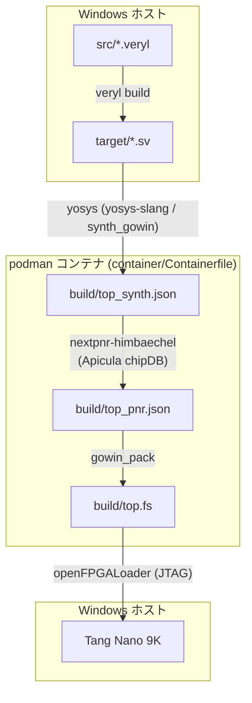

# hello_veryl

[](https://github.com/sabas0ba/hello_veryl/actions/workflows/ci.yml)

[Veryl](https://veryl-lang.org/) で記述したLチカを OSS ツールチェーンのみで
Tang Nano 9K (GOWIN GW1NR-LV9QN88PC6/I5) 上で動作させるプロジェクト．

## RTL 設計

`Top`（`src/top.veryl`）が `Blink`（`src/blink.veryl`）を generate for で 6 個インスタンス化し，
各 LED を BlinkFreq = 1〜6 で点滅させる．クロックは 27 MHz オシレータ，
リセットは S1 ボタン（active-low，Veryl 既定リセット async_low と整合）．

### ピン割当

`constraints/tangnano9k.cst` に記載（ピン番号の出典は Sipeed 公式サンプル，記述は独自）．

| 信号 | ピン | 備考 |
|---|---|---|
| i_clk | 52 | 27 MHz オシレータ |
| i_rst | 4 | S1 ボタン，active-low |
| leds[5:0] | 16,15,14,13,11,10 | active-low |

### テスト（シミュレーション）

```powershell
veryl test
```

## ビルド・書き込みフロー



合成～bitstream 生成は podman コンテナ内で実行する．Windows ネイティブ実行は
Smart App Control が未署名バイナリ（nextpnr 等）をブロックするため非採用
（SAC 無効環境向けに `scripts/build.ps1` を残置）．

### 外部依存のバージョン固定

| 対象 | バージョン | ハッシュ | 取得元 |
|---|---|---|---|
| コンテナ base image | Debian 13 (slim) | digest `020c0d20b988...76a7bd` | docker.io/library/debian:13-slim |
| OSS CAD Suite（コンテナ内） | 2026-07-20 | SHA-256 `ba680b02915b...2ea2a53` | https://github.com/YosysHQ/oss-cad-suite-build/releases/download/2026-07-20/oss-cad-suite-linux-x64-20260720.tgz |
| OSS CAD Suite（Windows, 書き込み用） | 2026-07-20 | SHA-256 `03ab812dcd2e...fed5893` | https://github.com/YosysHQ/oss-cad-suite-build/releases/download/2026-07-20/oss-cad-suite-windows-x64-20260720.exe |

完全なハッシュ値は `container/Containerfile`・`scripts/setup-toolchain.ps1` に記載し，
各スクリプトが取得時に検証する（不一致で中断）．GitHub Releases API / Docker Hub の
digest と照合済み．上流に署名はなく digest も配布物と同一オリジンのため，この pin が
保証するのは転送路改竄と pin 後の変更の検出まで．

### 必要環境

| 要件 | 動作確認 | 用途 |
|---|---|---|
| Windows 11 + PowerShell 5.1 以降 | — | スクリプト実行 |
| [Veryl](https://veryl-lang.org/) | 0.20.2 | Veryl → SystemVerilog（ホスト側） |
| [Podman](https://podman.io/) | 5.8.3 + WSL2 マシン | 合成コンテナの実行 |
| Windows 版 OSS CAD Suite | 2026-07-20 | 書き込み（`scripts/setup-toolchain.ps1` で導入） |
| [Zadig](https://zadig.akeo.ie/) | — | JTAG ドライバの WinUSB 化（初回のみ） |

### 手順

#### 1. 書き込みツール準備（初回のみ）

```powershell
.\scripts\setup-toolchain.ps1
```

Windows 版 OSS CAD Suite をダウンロード・SHA-256 検証し，`tools/`（git 管理外）へ展開する．
システム PATH・レジストリは変更しない（撤去は `tools/` の削除のみ）．

#### 2. USB ドライバ設定（書き込み前に初回のみ・手動）

[Zadig](https://zadig.akeo.ie/) で以下を実施する（本フローで唯一のシステム変更）：

- **JTAG Debugger (Interface 0)**（VID 0403 / PID 6010）のドライバを **WinUSB** に置き換える
- Interface 1 は UART（COM ポート）のため置き換えない
- 復帰: デバイスマネージャでドライバ削除 → 再接続

#### 3. ビルド（合成～bitstream 生成）

```powershell
.\scripts\build-container.ps1
```

ホストで `veryl build` 後，コンテナ内で合成～bitstream 生成（初回のみイメージ構築）．

#### 4. 書き込み

```powershell
.\scripts\flash.ps1          # SRAM へロード（電源断で消える）
.\scripts\flash.ps1 -Flash   # 内蔵フラッシュへ書き込み（永続）
```

## ディレクトリ構成

```
src/           Veryl ソース (top.veryl, blink.veryl)
constraints/   物理制約 (tangnano9k.cst)
container/     Containerfile（合成用イメージ定義，pin 済み）
scripts/       build-container.ps1 / synth_pnr.sh / synth.ys / flash.ps1
               setup-toolchain.ps1 / build.ps1 (ネイティブ版，SAC 無効環境用)
target/        Veryl が生成する SystemVerilog（git 管理外）
build/         合成・配置配線・bitstream 出力（git 管理外）
tools/         Windows 版 OSS CAD Suite 展開先（git 管理外）
```

## References

| 資料 | 内容 | URL |
|---|---|---|
| Veryl | HDL 本体・ドキュメント | https://veryl-lang.org/ |
| OSS CAD Suite | ツールチェーンバンドル（下記ツールを同梱） | https://github.com/YosysHQ/oss-cad-suite-build |
| Yosys | 論理合成 | https://github.com/YosysHQ/yosys |
| yosys-slang | SystemVerilog フロントエンド | https://github.com/povik/yosys-slang |
| nextpnr | 配置配線（himbaechel/gowin） | https://github.com/YosysHQ/nextpnr |
| Project Apicula | GOWIN bitstream 資料・gowin_pack | https://github.com/YosysHQ/apicula |
| openFPGALoader | 書き込み（board 定義 `tangnano9k`） | https://trabucayre.github.io/openFPGALoader/ |
| Podman | コンテナランタイム | https://podman.io/ |
| Podman Desktop | Podman 導入・管理 GUI | https://podman-desktop.io/ |
| Debian container image | ベースイメージ（digest 固定） | https://hub.docker.com/_/debian |
| Tang Nano 9K wiki | ボード仕様 | https://wiki.sipeed.com/hardware/en/tang/Tang-Nano-9K/Nano-9K.html |
| Tang Nano 9K 回路図 | 回路・ピンの一次資料 | https://dl.sipeed.com/shareURL/TANG/Nano%209K/2_Schematic |
| Sipeed 公式サンプル | ピン割当の出典 | https://github.com/sipeed/TangNano-9K-example/blob/main/led/src/9K_LED_project.cst |
| Zadig | WinUSB ドライバ割当 | https://zadig.akeo.ie/ |
