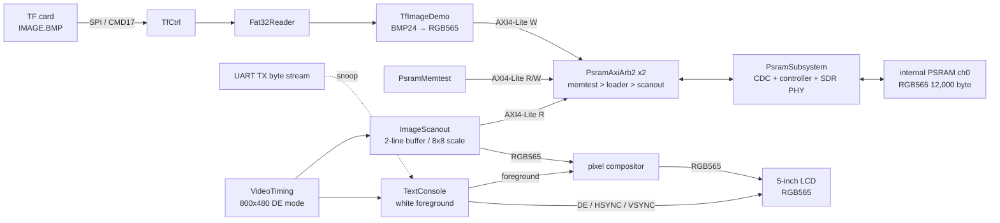

# hello_veryl

[](https://github.com/sabas0ba/hello_veryl/actions/workflows/ci.yml)

[Veryl](https://veryl-lang.org/) で記述した Lチカ・UART エコー・LCD画像／
テキストコンソール・内蔵PSRAMコントローラ（起動時memtest）を
OSSツールチェーンのみで Tang Nano 9K (GOWIN GW1NR-LV9QN88PC6/I5) 上に実装する．

## LCD 画像デモ

TFカードのルートにある無圧縮24 bpp `IMAGE.BMP`を読み，RGB565へ変換して
内蔵PSRAMへ展開し，5インチ800x480 LCDへ表示する．入力画像は100x60固定で，
`ImageScanout`が各画素を8x8複製する．UARTの診断文字列は白文字で画像の前面へ重ねる．


上図は2026-08-29の実機確認に使用した入力PNGである．100x60 BMPへの変換，
XMODEM-CRCによるTFカードへの転送，PSRAMへのロード，LCD表示まで確認済み．

### 実行方法

初回セットアップを済ませた後，入力PNGをデモ用BMPへ変換する．Pythonを含む
ツールは固定済みコンテナ内のものを使用する．

```powershell
.\scripts\fpga-run.ps1 `
    /opt/oss-cad-suite/py3bin/python3 scripts/gen_demo_bmp.py `
    --from assets/lcd-validation-spacecraft.png -o build/IMAGE.BMP
```

生成された `build/IMAGE.BMP`（100x60，24 bpp，18,054 byte）をFAT32形式の
TFカードのルートへコピーする．カードを取り外さずUARTで更新する場合は，
モニタ版`TopRv`と`tfimage`を使ってXMODEM-CRC転送する．

```powershell
.\scripts\fpga-run.ps1 bash software/build_demo.sh tfimage ram
.\scripts\fpga-run.ps1 bash software/build.sh monitor
.\scripts\build-rv.ps1
.\scripts\flash.ps1 -Bitstream build\top_rv.fs
.\scripts\rv-xmodem.ps1 `
    -Receiver build\software\tfimage.bin `
    -Bin build\IMAGE.BMP -Port COM4
```

転送後は既定ROMを復元して通常`Top`をビルドし，FPGAのSRAMへ書き込む．

```powershell
.\scripts\fpga-run.ps1 bash software/build.sh hello
.\scripts\build-container.ps1
.\scripts\flash.ps1 -Bitstream build\top.fs
```

別ターミナルで `.\scripts\uart-term.ps1 -Port COM4` を起動してS1を押すと，
初期化・memtest・画像ロードの結果を確認できる．正常時の出力は次のとおり．

```text
PSRAM INIT=1 MEMTEST=PASS ERR=0000 K=00000 RD=00000000
IMG OK
```

### 実機結果

| 確認項目 | 結果 |
| --- | --- |
| FPGA SRAM書込み | Tang Nano 9KでCRC照合成功 |
| XMODEM-CRC | 18,054 byteを142ブロックで転送．ブロック2の`SOH`欠落注入に対し`NAK`後の再送成功 |
| TFカード再読出し | `IMAGE.BMP`のサイズ18,054 byteとBMPヘッダを確認 |
| PSRAM | 初期化，IR0照合，1,024語memtest，RGB565フレームバッファ展開に成功 |
| LCD | 生成画像と前景の診断文字列を800x480で正常表示 |

### 内部回路



起動時はPSRAM初期化と1,024語memtestを先に行い，成功後に画像をロードする．
ロード完了まではスキャンアウトを無効化する．PSRAMは54 MHzドメイン，それ以外は
27 MHzドメインで動作し，クロック交差は`PsramSubsystem`内に閉じ込めている．
100x60 RGB565フレームバッファは12,000 byteで，二面ラインバッファにより
PSRAMからの読出し帯域を約709 kB/sに抑える．詳細は
[TFカード画像デモ](docs/tfcard.md)，[PSRAMサブシステム](docs/psram.md)，
[XMODEM転送](docs/riscv.md)を参照．

## 必要環境

| 要件 | 動作確認 | 用途 |
| --- | --- | --- |
| Windows 11 + PowerShell 5.1 以降 | — | スクリプト実行 |
| [Podman](https://podman.io/) | 5.8.3 + WSL2 マシン | ビルドコンテナの実行（veryl 含む，ホストへの veryl 導入は不要） |
| Windows 版 OSS CAD Suite | 2026-07-20 | 書き込み（下記手順 1 で導入） |
| [Zadig](https://zadig.akeo.ie/) | — | JTAG ドライバの WinUSB 化（初回のみ） |

## 初回セットアップ

### 1. 書き込みツール準備

```powershell
.\scripts\setup-toolchain.ps1
```

Windows 版 OSS CAD Suite をダウンロード・SHA-256 検証し，`tools/`（git 管理外）へ展開する．
システム PATH・レジストリは変更しない（撤去は `tools/` の削除のみ）．

### 2. USB ドライバ設定（手動）

[Zadig](https://zadig.akeo.ie/) で以下を実施する（本フローで唯一のシステム変更）:

- **JTAG Debugger (Interface 0)**（VID 0403 / PID 6010）のドライバを **WinUSB** に置き換える
- Interface 1 は UART（COM ポート）のため置き換えない
- 復帰: デバイスマネージャでドライバ削除 → 再接続

## ビルド・書き込み・動作確認

```powershell
.\scripts\build-container.ps1          # ビルド（コンテナ内で合成～bitstream 生成）
.\scripts\flash.ps1                    # SRAM へロード（電源断で消える）
.\scripts\flash.ps1 -Flash             # 内蔵フラッシュへ書き込み（永続）
.\scripts\uart-send.ps1 -Data "hello"  # 動作確認: 1回送信して応答表示 (-Hex でバイト列表示)
.\scripts\uart-term.ps1                # 動作確認: 対話ターミナル (Esc で終了)
```

送信した文字がエコーされ，同じ内容が LCD へ表示される（ローカルエコーは無効にする）．
S1 ボタンで画面全消去．各操作は VSCode の tasks.json からも実行できる．

## ドキュメント

| 文書 | 内容 |
| --- | --- |
| [docs/](docs/README.md) | 設計（RTL・PSRAM サブシステム・検証方針・開発環境） |
| [CONTRIBUTING.md](CONTRIBUTING.md) | 貢献（運用ルール・注意事項） |
