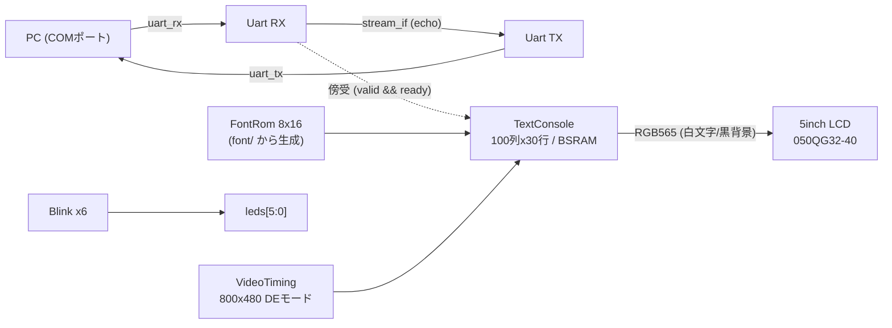
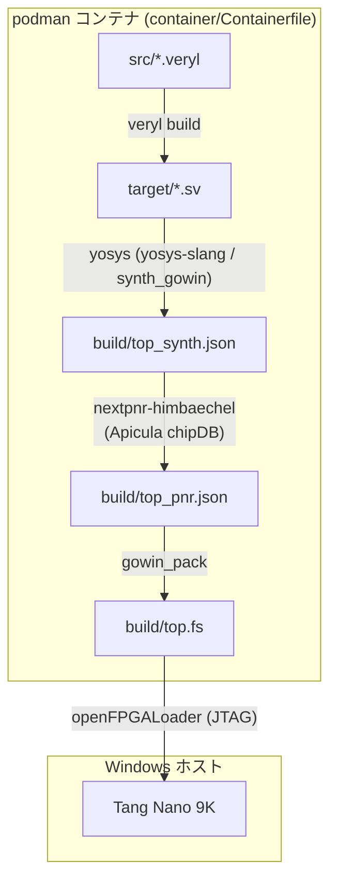

# hello_veryl

[](https://github.com/sabas0ba/hello_veryl/actions/workflows/ci.yml)

[Veryl](https://veryl-lang.org/) で記述した Lチカ・UART エコー・LCD テキストコンソールを
OSS ツールチェーンのみで Tang Nano 9K (GOWIN GW1NR-LV9QN88PC6/I5) 上で動作させるプロジェクト．

## RTL 設計

クロックは 27 MHz オシレータ単一ドメイン（PLL 不使用），リセットは S1 ボタン
（active-low，Veryl 既定リセット async_low と整合）．



| モジュール | ファイル | 概要 |
|---|---|---|
| Top | src/top.veryl | 全体統合（UARTエコー + 傍受テキスト表示 + LED点滅） |
| Blink | src/blink.veryl | 分周点滅（BlinkFreq = 1〜6 Hz で 6 個生成） |
| stream_if | src/common/stream.veryl | valid/ready ハンドシェイクの汎用 stream interface |
| Uart | src/uart/uart.veryl | 115200bps 8N1．RX は 2FF 同期 + 中央サンプリング，ノンブロッキング供給 |
| VideoTiming | src/video/timing.veryl | LCD タイミング生成（datasheet 導出の 27MHz 直結 59.1Hz，HTotal=890 x VTotal=513） |
| TextConsole | src/video/console.veryl | 文字書き込み（LF/CR/折り返し/リングバッファスクロール）+ 描画 2 段パイプライン |
| FontRom | src/video/font_rom.veryl | 8x16 フォント ROM（生成物，編集しない） |

テキスト表示は UART TX（エコー経路）へ流れるバイトを傍受する構成のため，
PC から送った文字がエコーと同時に LCD へ蓄積される．printable (0x20-0x7E) 表示，
LF=改行，CR=行頭復帰，その他は無視．右端折り返しと最下行スクロールに対応する．

### フォント

`font/font8x16.txt`（[font8x16-workbench](https://github.com/sabas0ba/font8x16-workbench)，
CC0 1.0）を一次ソースとし，`scripts/gen_font_rom.py`（Python 標準ライブラリのみ）で
`src/video/font_rom.veryl` を生成する．フォント更新時は再生成してコミットする:

```powershell
python .\scripts\gen_font_rom.py
```

### ピン割当

`constraints/tangnano9k.cst` に記載（ピン番号の出典は Sipeed 公式サンプル，記述は独自）．

| 信号 | ピン | 備考 |
|---|---|---|
| i_clk | 52 | 27 MHz オシレータ |
| i_rst | 4 | S1 ボタン，active-low |
| leds[5:0] | 16,15,14,13,11,10 | active-low |
| uart_tx / uart_rx | 17 / 18 | BL702 経由の USB-CDC シリアル |
| lcd_clk / lcd_de | 35 / 33 | pclk は反転出力（ラッチエッジと遷移を半周期分離） |
| lcd_vsync / lcd_hsync | 34 / 40 | 負極性 |
| lcd_r[4:0] | 75,74,73,72,71 | RGB565 |
| lcd_g[5:0] | 70,69,68,57,56,55 | |
| lcd_b[4:0] | 54,53,51,42,41 | |

### テスト（シミュレーション）

```powershell
.\scripts\veryl.ps1 test
```

Veryl ネイティブテスト 13 件（Blink 3 / UART TX・RX・loopback・overrun 7 /
VideoTiming 1 / TextConsole 2）．CI は `veryl fmt --check` → `check` → `build` →
`test` を実行し，Warning でも失敗する（`veryl check` は Warning のみでも exit 1）．
コミット前に `.\scripts\veryl.ps1 fmt` を適用すること．

veryl はコンテナ内で実行する（`.\scripts\veryl.ps1 <args>` が任意の veryl サブコマンドを
コンテナへ中継する）．`--wave` を付けると VCD がソースファイルの隣に出力される
（例: `src/test_blink_small.vcd`．ビューアは未導入）．`--sim verilator` で
イメージ同梱の Verilator による実行も可能．

### DevContainer（RTL 設計用，任意）

`.devcontainer/devcontainer.json` は `container/Containerfile` と同一イメージを参照し，
VSCode の Dev Containers 拡張（Microsoft 製）で「Reopen in Container」すると
Veryl 拡張（0.20.2 固定）と veryl-ls がコンテナ内で動作する（SAC の影響を受けない）．

- podman 利用のため VSCode 設定に `"dev.containers.dockerPath": "podman"` が必要
- 初回起動時のみ vscode-server 取得のためコンテナにネットワークアクセスが発生する
- 実機 I/O（書き込み・UART）はホスト側ウィンドウの tasks.json から実行する（二窓運用）

## ビルド・書き込みフロー



Veryl のトランスパイル・テストから合成～bitstream 生成までを podman コンテナ内で
実行する．Windows ネイティブ実行は Smart App Control が未署名バイナリ
（veryl，nextpnr 等）をブロックするため非採用（SAC 無効環境向けに
`scripts/build.ps1` を残置）．

### 外部依存のバージョン固定

| 対象 | バージョン | ハッシュ | 取得元 |
|---|---|---|---|
| コンテナ base image | Debian 13 (slim) | digest `020c0d20b988...76a7bd` | docker.io/library/debian:13-slim |
| Veryl（コンテナ内） | 0.20.2 | SHA-256 `217c94e9dccb...71b4c2` | https://github.com/veryl-lang/veryl/releases/download/v0.20.2/veryl-x86_64-linux.zip |
| OSS CAD Suite（コンテナ内） | 2026-07-20 | SHA-256 `ba680b02915b...2ea2a53` | https://github.com/YosysHQ/oss-cad-suite-build/releases/download/2026-07-20/oss-cad-suite-linux-x64-20260720.tgz |
| OSS CAD Suite（Windows, 書き込み用） | 2026-07-20 | SHA-256 `03ab812dcd2e...fed5893` | https://github.com/YosysHQ/oss-cad-suite-build/releases/download/2026-07-20/oss-cad-suite-windows-x64-20260720.exe |

完全なハッシュ値は `container/Containerfile`・`scripts/setup-toolchain.ps1` に記載し，
各スクリプトが取得時に検証する（不一致で中断）．GitHub Releases API / Docker Hub の
digest と照合済み．上流に署名はなく digest も配布物と同一オリジンのため，この pin が
保証するのは転送路改竄と pin 後の変更の検出まで．

### 必要環境

| 要件 | 動作確認 | 用途 |
|---|---|---|
| Windows 11 + PowerShell 5.1 以降 | — | スクリプト実行 |
| [Podman](https://podman.io/) | 5.8.3 + WSL2 マシン | ビルドコンテナの実行（veryl 含む，ホストへの veryl 導入は不要） |
| Windows 版 OSS CAD Suite | 2026-07-20 | 書き込み（`scripts/setup-toolchain.ps1` で導入） |
| [Zadig](https://zadig.akeo.ie/) | — | JTAG ドライバの WinUSB 化（初回のみ） |

### 手順

#### 1. 書き込みツール準備（初回のみ）

```powershell
.\scripts\setup-toolchain.ps1
```

Windows 版 OSS CAD Suite をダウンロード・SHA-256 検証し，`tools/`（git 管理外）へ展開する．
システム PATH・レジストリは変更しない（撤去は `tools/` の削除のみ）．

#### 2. USB ドライバ設定（書き込み前に初回のみ・手動）

[Zadig](https://zadig.akeo.ie/) で以下を実施する（本フローで唯一のシステム変更）：

- **JTAG Debugger (Interface 0)**（VID 0403 / PID 6010）のドライバを **WinUSB** に置き換える
- Interface 1 は UART（COM ポート）のため置き換えない
- 復帰: デバイスマネージャでドライバ削除 → 再接続

#### 3. ビルド（合成～bitstream 生成）

```powershell
.\scripts\build-container.ps1
```

コンテナ内で `veryl build` から合成～bitstream 生成まで実行する（初回のみイメージ構築）．

#### 4. 書き込み

```powershell
.\scripts\flash.ps1          # SRAM へロード（電源断で消える）
.\scripts\flash.ps1 -Flash   # 内蔵フラッシュへ書き込み（永続）
```

#### 5. 動作確認（UART / LCD）

```powershell
.\scripts\uart-send.ps1 -Data "hello"   # 1回送信して応答表示 (-Hex でバイト列表示)
.\scripts\uart-term.ps1                 # 対話ターミナル (Escで終了)
```

送信した文字がエコーされ，同じ内容が LCD へ表示される（ローカルエコーは無効にする）．
S1 ボタンで画面全消去．各操作は VSCode の tasks.json からも実行できる．

## ディレクトリ構成

```
src/           Veryl ソース
  common/        stream_if
  uart/          UART TX/RX
  video/         VideoTiming / TextConsole / FontRom (生成物)
  top.veryl, blink.veryl
font/          フォント一次ソース (font8x16.txt, CC0 1.0)
.devcontainer/ RTL 設計用 DevContainer 定義（container/ と同一イメージ）
constraints/   物理制約 (tangnano9k.cst)
container/     Containerfile（veryl + 合成ツールのイメージ定義，pin 済み）
scripts/       veryl.ps1 / build-container.ps1 / synth_pnr.sh / synth.ys / flash.ps1
               uart-send.ps1 / uart-term.ps1 / gen_font_rom.py / ci.sh
               setup-toolchain.ps1 / build.ps1 (ネイティブ版，SAC 無効環境用)
target/        Veryl が生成する SystemVerilog（git 管理外）
build/         合成・配置配線・bitstream 出力（git 管理外）
tools/         Windows 版 OSS CAD Suite 展開先（git 管理外）
```

## References

| 資料 | 内容 | URL |
|---|---|---|
| Veryl | HDL 本体・ドキュメント | https://veryl-lang.org/ |
| OSS CAD Suite | ツールチェーンバンドル（下記ツールを同梱） | https://github.com/YosysHQ/oss-cad-suite-build |
| Yosys | 論理合成 | https://github.com/YosysHQ/yosys |
| yosys-slang | SystemVerilog フロントエンド | https://github.com/povik/yosys-slang |
| nextpnr | 配置配線（himbaechel/gowin） | https://github.com/YosysHQ/nextpnr |
| Project Apicula | GOWIN bitstream 資料・gowin_pack | https://github.com/YosysHQ/apicula |
| openFPGALoader | 書き込み（board 定義 `tangnano9k`） | https://trabucayre.github.io/openFPGALoader/ |
| Podman | コンテナランタイム | https://podman.io/ |
| Podman Desktop | Podman 導入・管理 GUI | https://podman-desktop.io/ |
| Debian container image | ベースイメージ（digest 固定） | https://hub.docker.com/_/debian |
| Tang Nano 9K wiki | ボード仕様 | https://wiki.sipeed.com/hardware/en/tang/Tang-Nano-9K/Nano-9K.html |
| Tang Nano 9K 回路図 | 回路・ピンの一次資料 | https://dl.sipeed.com/shareURL/TANG/Nano%209K/2_Schematic |
| Sipeed 公式サンプル (LED) | LEDピン割当の出典 | https://github.com/sipeed/TangNano-9K-example/blob/main/led/src/9K_LED_project.cst |
| Sipeed 公式サンプル (UART/LCD) | UART・LCDピン割当の出典 | https://github.com/sipeed/TangNano-9K-example |
| 5inch LCD datasheet | LCDタイミングの一次資料 (6.4節) | https://dl.sipeed.com/fileList/TANG/Nano%209K/6_Chip_Manual/EN/LCD_Datasheet/5.0inch_LCD_Datashet%20_RGB_.pdf |
| Sipeed Wiki rgb_screen | LCD接続チュートリアル (sync極性等) | https://github.com/sipeed/sipeed_wiki/blob/main/docs/hardware/en/tang/Tang-Nano-9K/examples/rgb_screen.md |
| font8x16-workbench | フォントデータ (CC0 1.0) と編集ツール | https://github.com/sabas0ba/font8x16-workbench |
| Zadig | WinUSB ドライバ割当 | https://zadig.akeo.ie/ |
