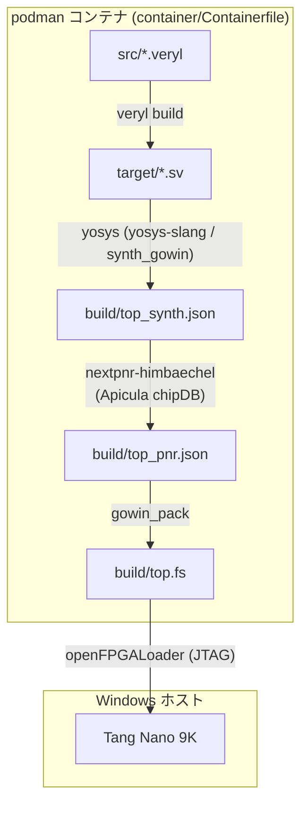

# 開発環境

開発環境の構成と使い方．運用ルールは
[CONTRIBUTING.md](../CONTRIBUTING.md)，設計は [rtl.md](rtl.md) を参照．

## ビルドフロー



Veryl のトランスパイル・テストから合成～bitstream 生成までを podman コンテナ内で
実行する．Windows ネイティブ実行は Smart App Control が未署名バイナリ
（veryl，nextpnr 等）をブロックするため非採用（SAC 無効環境向けに
`scripts/build.ps1` を残置）．

veryl はコンテナ内で実行する（`.\scripts\veryl.ps1 <args>` が任意の veryl
サブコマンドをコンテナへ中継する）．コンテナイメージは初回実行時のみ構築され，
以降はキャッシュが使われる．

## DevContainer（RTL 設計用，任意）

`.devcontainer/devcontainer.json` は `container/Containerfile` と同一イメージを参照し，
VSCode の Dev Containers 拡張（Microsoft 製）で「Reopen in Container」すると
Veryl 拡張（0.20.2 固定）と veryl-ls がコンテナ内で動作する（SAC の影響を受けない）．

- podman 利用のため VSCode 設定に `"dev.containers.dockerPath": "podman"` が必要
- 初回起動時のみ vscode-server 取得のためコンテナにネットワークアクセスが発生する
- 実機 I/O（書き込み・UART）はホスト側ウィンドウの tasks.json から実行する（二窓運用）

## テストの実行

```powershell
.\scripts\veryl.ps1 test
```

- `--wave` で VCD がソースファイルの隣に出力される
  （例: `src/test_blink_small.vcd`．ビューアは未導入）
- `--sim verilator` でイメージ同梱の Verilator による実行も可能
- CI は `veryl fmt --check` → `check` → `build` → `test` を実行する
  （合否条件などの規約は [CONTRIBUTING.md](../CONTRIBUTING.md)）
- テストの一覧・検証レイヤの割当は [verification.md](verification.md) を参照

## ドキュメント生成

```powershell
.\scripts\veryl.ps1 doc
```

- ソース中の `///` ドキュメンテーションコメント（markdown / mermaid / wavedrom
  対応）から HTML を `doc/`（git 管理外）へ生成する
- 対象は `pub` 付きの要素のみ（テストモジュールは非 pub のため除外される）
- main への push で CI（`.github/workflows/docs.yml`）が GitHub Pages へ公開する
  （リポジトリ設定 Pages の Source を "GitHub Actions" にしておくこと）

## 外部依存のバージョン固定

| 対象 | バージョン | ハッシュ | 取得元 |
| --- | --- | --- | --- |
| コンテナ base image | Debian 13 (slim) | digest `020c0d20b988...76a7bd` | docker.io/library/debian:13-slim |
| Veryl（コンテナ内） | 0.20.2 | SHA-256 `217c94e9dccb...71b4c2` | <https://github.com/veryl-lang/veryl/releases/download/v0.20.2/veryl-x86_64-linux.zip> |
| OSS CAD Suite（コンテナ内） | 2026-07-20 | SHA-256 `ba680b02915b...2ea2a53` | <https://github.com/YosysHQ/oss-cad-suite-build/releases/download/2026-07-20/oss-cad-suite-linux-x64-20260720.tgz> |
| OSS CAD Suite（Windows, 書き込み用） | 2026-07-20 | SHA-256 `03ab812dcd2e...fed5893` | <https://github.com/YosysHQ/oss-cad-suite-build/releases/download/2026-07-20/oss-cad-suite-windows-x64-20260720.exe> |

完全なハッシュ値は `container/Containerfile`・`scripts/setup-toolchain.ps1` に記載し，
各スクリプトが取得時に検証する（不一致で中断）．GitHub Releases API / Docker Hub の
digest と照合済み．上流に署名はなく digest も配布物と同一オリジンのため，この pin が
保証するのは転送路改竄と pin 後の変更の検出まで．

## ディレクトリ構成

```
src/           Veryl ソース
  common/        stream_if
  uart/          UART TX/RX
  video/         VideoTiming / TextConsole / FontRom (生成物)
  top.veryl, blink.veryl
docs/          設計・検証文書（datasheets/ は git 管理外）
font/          フォント一次ソース (font8x16.txt, CC0 1.0)
.devcontainer/ RTL 設計用 DevContainer 定義（container/ と同一イメージ）
constraints/   物理制約 (tangnano9k.cst)
container/     Containerfile（veryl + 合成ツールのイメージ定義，pin 済み）
scripts/       veryl.ps1 / build-container.ps1 / synth_pnr.sh / synth.ys / flash.ps1
               uart-send.ps1 / uart-term.ps1 / gen_font_rom.py / ci.sh
               setup-toolchain.ps1 / build.ps1 (ネイティブ版，SAC 無効環境用)
target/        Veryl が生成する SystemVerilog（git 管理外）
build/         合成・配置配線・bitstream 出力（git 管理外）
tools/         Windows 版 OSS CAD Suite 展開先（git 管理外）
```

## References（ツールチェーン）

| 資料 | 内容 | URL |
| --- | --- | --- |
| Veryl | HDL 本体・ドキュメント | <https://veryl-lang.org/> |
| OSS CAD Suite | ツールチェーンバンドル（下記ツールを同梱） | <https://github.com/YosysHQ/oss-cad-suite-build> |
| Yosys | 論理合成 | <https://github.com/YosysHQ/yosys> |
| yosys-slang | SystemVerilog フロントエンド | <https://github.com/povik/yosys-slang> |
| nextpnr | 配置配線（himbaechel/gowin） | <https://github.com/YosysHQ/nextpnr> |
| Project Apicula | GOWIN bitstream 資料・gowin_pack | <https://github.com/YosysHQ/apicula> |
| openFPGALoader | 書き込み（board 定義 `tangnano9k`） | <https://trabucayre.github.io/openFPGALoader/> |
| Podman | コンテナランタイム | <https://podman.io/> |
| Podman Desktop | Podman 導入・管理 GUI | <https://podman-desktop.io/> |
| Debian container image | ベースイメージ（digest 固定） | <https://hub.docker.com/_/debian> |
| Zadig | WinUSB ドライバ割当 | <https://zadig.akeo.ie/> |
