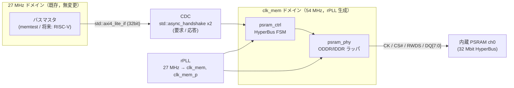

# PSRAM コントローラ設計文書

Tang Nano 9K (GW1NR-LV9QN88PC6/I5) の SIP 内蔵 PSRAM（HyperBus，2x32 Mbit）を
OSS ツールチェーンのみで利用するためのコントローラ設計．
既存資産とツールチェーン pin を変更せず，サブシステム追加として実装する．
検証レイヤの定義・運用規則は [verification.md](verification.md)，
既存デザインは [rtl.md](rtl.md) を参照．

## 方針

- 外部 RTL の引用・流用は行わず，一次資料（データシート・仕様書）から自前実装する
- 既存 OSS 実装（zf3/psram-tang-nano-9k，Apache-2.0）は到達点の目安
  （1:1 クロックで最大 83 MHz）としてのみ参照し，コードは参照しない
- バス IF・CDC は Veryl 標準ライブラリを採用し，自作範囲を
  HyperBus コントローラ FSM・物理層ラッパ・検証用モデルに限定する

## 一次資料

データシート実体は再配布制限のため git 管理外（`docs/datasheets/`，gitignore 済み）に
置き，本表で版数・取得元・SHA-256 を記録する．

| 資料 | 用途 | 取得元 | 版数 | SHA-256 |
| --- | --- | --- | --- | --- |
| Winbond W955D8MBYA datasheet | HyperBus プロトコル・レイテンシ・CR/IR 定義（内蔵ダイは本品のコピーとされる） | winbond.com/resource-files/W955D8MBYA_85C_PKG_datasheet_A01-001_20190605.pdf | A01-001 (2019-06-05) | `a735c54f5b7df8e9b32412eb4d663ba245da9fa37ed32725e70b4f274f8cf14d` |
| Winbond W956x8MBYA datasheet | 同上の 64 Mbit 版（プロトコル同一，補完用） | winbond.com（DL ゲートウェイ経由，利用者取得） | A01-002 (2019-11-13) | `795c6e412890ef3e740150b248e400df5f687c7024a29b9efe1a740983f3a89b` |
| Gowin DS117 (GW1NR Data Sheet) | PSRAM 構成・電気仕様（PSRAM IF は 1.8 V） | cdn.gowinsemi.com.cn/DS117E.pdf | DS117-3.2.4E (2026-03-27) | `5801e4d10d080cec37e1a775dd4a8ce2fbd8ed513eefa1d478dd602bcb5ac313` |
| Gowin UG289 (Programmable IO) | ODDR/IDDR ポート・パラメータ定義 | cdn.gowinsemi.com.cn/UG289E.pdf | UG289-2.2.1E (2025-12-19) | `edec5c97e813e41cfbb6d49ab3bea2a8c8c28b92ec3234c74e865cbd4c88d1db` |
| Gowin UG286 (Clock) | rPLL 分周比・位相シフト設定 | cdn.gowinsemi.com.cn/UG286E.pdf | UG286-2.0.2E (2025-12-19) | `9e047c027228d085a781ccebabfa6094bedabb569103bd750da0cca40d8f0a8d` |
| UG803 (GW1NR-9 Pinout) | PSRAM マジックポートの正式定義 | cdn.gowinsemi.com.cn/UG803E.pdf | UG803-1.6.5E (2025-03-07) | `ebe1350849abb5903c2c934a33d19c27635b50c1b09eee27968fc894f5fef836` |

- W955D8MBYA には新版 A01-002 (2022-09-16) が存在するが，winbond.com の
  ダウンロードゲートウェイ（対話的 DL）経由のため未取得．直接 URL で取得可能な
  A01-001 を採用し，差分が問題になった場合に新版を手動取得する
- UG803 は公式 CDN から正式版を取得済み（旧記載「Scribd 転載 v1.6E のみ確認」を更新）

注: 内蔵ダイの型番は Gowin 非公開であり，W955D8MBYA 相当というのはコミュニティの
解析結果である．spike の IR0 読み出しで製造者 ID・密度を実機確認する．

## アーキテクチャ



### クロック

| クロック | 周波数 | 生成 | 用途 |
| --- | --- | --- | --- |
| i_clk | 27 MHz | オシレータ（既存） | バスマスタ側，CDC の片側 |
| clk_mem | 54 MHz | rPLL（位相 0°） | コントローラ FSM，DDR レジスタ |
| clk_mem_p | 54 MHz | rPLL（位相シフト，90° 目安） | CK 出力（データ中央でラッチさせる） |

- 27 MHz 単一ドメイン方針（[rtl.md](rtl.md)）の例外として
  PSRAM サブシステムを追加する．既存モジュールのドメインは変更しない
- Veryl のクロックドメイン注釈により両ドメインは型レベルで区別し，
  交差点は `unsafe (cdc)` ブロック内の `$std::async_handshake` に限定する
  （交差の網羅性は L0 でコンパイラが保証する）
- 54 MHz は既存 OSS 実装の到達点 83 MHz に対する安全側の初期値．
  nextpnr のタイミングモデルの保守性が未知（L3 の限界）のため，
  動作確認後の引き上げは性能改善として別パッチで行う
- 位相シフト量は初期値 90° とし，実機で調整する（L4 残余⑤）

### バス IF: std::axi4_lite_if

- `axi4_lite_pkg::<ADDR_W=22, DATA_W_BYTES=4, ID_W=1>`（ch0 の 4 MB 空間）
- 32 bit データ幅（AXI4-Lite 標準）．コントローラ内部で 16 bit HyperBus
  アクセス 2 回に分割する．WSTRB[3:0] は 16 bit アクセスの
  バイトマスク 2 組へ写像し，全マスク 0 の半語はアクセス自体を省略する
- 単一アウトスタンディング．AW と W は到着順非依存で合流させ，
  両方揃ってから発行する
- 応答は常に OKAY（PSRAM はエラー応答を持たない．初期化未完了時の
  アクセスは ready を落として待たせる）

採用理由: バーストなし単一トランザクションの要件に合致し，
将来の RISC-V (32 bit) 接続にアダプタなしで繋がる．AXI は Arm が仕様公開する
ロイヤリティフリー規格であり，stdlib（MIT OR Apache-2.0）はコンパイラ同梱のため
外部依存も増えない．stdlib API の安定性リスクは
[CONTRIBUTING.md](../CONTRIBUTING.md) の更新手順で扱う．

### CDC: std::async_handshake

- 要求パス（合成済み内部コマンド: addr / we / wdata / wstrb）と
  応答パス（rdata）にそれぞれ 1 個使用
- 単一アウトスタンディング前提のため非同期 FIFO は不要．
  バースト対応時に `$std::async_fifo` への置換を検討する

### コントローラ仕様（v1）

| 項目 | 決定 | 備考 |
| --- | --- | --- |
| 使用チャネル | ch0 のみ | ch1 はポート定義のみ（将来拡張） |
| レイテンシ | 固定レイテンシモード（常に 2x） | CR0 で設定．RWDS 監視による可変判定を省き FSM を単純化．可変化は性能改善パッチ |
| バースト | なし（16 bit 単発 x2） | |
| CK | 差動（CK/CK#，idle: CK=Low/CK#=High） | W955 系は差動クロック入力（データシート §7）．O_psram_ck_n は ~ck を駆動する（旧決定「非駆動固定」をデータシート確認により訂正） |
| 初期化 | 電源投入後 150 µs 待機 → CR0 書き込み → IR0 読み出しで疎通確認 | 待機は 27 MHz カウンタ，IR0 確認は自己診断を兼ねる |

### プロトコル仕様（W955D8MBYA A01-001 より確定）

出典: W955D8MBYA datasheet §7（CA・Read/Write），§9（Register Space），
§11.2.4・§11.6（タイミング）．W956x8MBYA A01-002 と共通．

**CA（Command/Address）**: CS# アサート後，最初の 3 クロック（6 エッジ，DDR）で
48 bit の CA を CA0[47:40] から 8 bit ずつ MSB first で転送する（CK 中央整列）．

| CA bit | 名称 | 内容 |
| --- | --- | --- |
| 47 | R/W# | 1=Read / 0=Write |
| 46 | AS | 0=メモリ空間 / 1=レジスタ空間 |
| 45 | Burst Type | 0=Wrap / 1=リニア（レジスタアクセスは 1） |
| 44:34 | Reserved | 0 |
| 33:22 | Row Address | システムワードアドレス A20-A9 |
| 21:16 | Upper Column | 同 A8-A3 |
| 15:3 | Reserved | 0 |
| 2:0 | Lower Column | 同 A2-A0 |

32 Mbit = 2M ワード（A20-A0，16 bit/ワード）= 4 MB/ch．AXI 側 22 bit
バイトアドレスの [21:1] をワードアドレスへ写像する（ADDR_W=22 と整合）．

**レジスタ空間**（CA[46]=1）: CA0[47:40] は Read=E0h / Write=60h．
IR0=アドレス 0，IR1=1，CR0 は CA[31:24]=01h・CA[7:0]=00h，CR1 は同 01h．

- レジスタ書き込みはレイテンシ 0（CA 直後に 1 ワード書く．RWDS はホスト非駆動）
- レジスタ読み出しはメモリ読み出しと同じレイテンシ規則（CR0[7:4] と RWDS）

**ID レジスタ（期待値）**: IR0[3:0]=1111b (Winbond)，IR0[6:4]=101b (32Mb)
→ IR0=005Fh，IR1[3:0]=1111b (HyperRAM) → IR1=000Fh．
spike 段 1 の IR0 実読はこの値と照合する．

**CR0**（POR デフォルト 8F1Fh）:

| bit | 名称 | デフォルト | 備考 |
| --- | --- | --- | --- |
| 15 | Deep Power Down Enable | 1 (通常動作) | 0 書き込みで DPD へ |
| 14:12 | Drive Strength | 000 (50Ω) | |
| 11:8 | Reserved | 1111 | 書き込み時も 1111 とする |
| 7:4 | Initial Latency | 0001 (6clk @166MHz) | 1110=3clk @83MHz / 1111=4clk @104MHz / 0000=5clk @133MHz |
| 3 | Fixed Latency Enable | 1 (固定 2x) | 0=可変（RWDS 判定） |
| 2 | Burst Type | 1 (legacy wrap) | |
| 1:0 | Burst Length | 11 (32B) | |

POR デフォルトが固定 2x レイテンシのため，**spike 段 1 は CR0 書き込みなしで
IR0 を読める**（レイテンシ 2x6=12 クロックで固定）．v1 コントローラは
54 MHz ≤ 83 MHz より CR0[7:4]=1110b（3 クロック，2x で 6）へ設定して
CR0[3]=1 を維持する（CR0 書き込み値 8FEFh）．

**タイミング（85°C 品）**:

| 項目 | 値 | 備考 |
| --- | --- | --- |
| tVCS | 150 µs | 電源投入/リセット後，初回アクセスまでの待機（設計の 150 µs 待機の根拠） |
| tRP | 200 ns min | RESET# パルス幅 |
| tCSM | 4 µs max | CS# Low 連続時間上限（リフレッシュ確保） |
| tRWR | 36 ns min | Read-Write Recovery（CS# 立ち上げ後の回復） |
| tACC | 36 ns min | 初期アクセス（レイテンシクロック数はこれを満たすよう選ぶ） |
| tCSS / tCSH | 2 ns / 0 ns min | CS# セットアップ/ホールド（対 CK エッジ） |
| tCSHI | 6 ns min | トランザクション間の CS# High 期間 |

### 物理層（psram_phy）

- Gowin プリミティブ ODDR / IDDR を SystemVerilog ラッパ経由
  （Veryl の `$sv::` 名前空間）でインスタンス化する
- Apicula 対応状況（Wiki 2024-11-19 版で確認済み）:
  ODDR/ODDRC/IDDR/IDDRC/rPLL は対応，IODELAY 系は未対応．
  本設計は IODELAY を使用しない（位相調整は rPLL の位相シフトで行う）
- DQ / RWDS の双方向制御は **Gowin IOBUF プリミティブの明示インスタンス化**で
  行う（`$sv::IOBUF` + blackbox スタブ `src/gowin_prims.sv`）．本フローの
  SV フロントエンド (yosys-slang) は `cond ? d : 'z` による tristate 推論で
  z を don't-care へ畳み込み，パッドが出力専用化して入力経路が消失する
  （spike 実装時に PnR 結果検査で確認．inout の直記述は使用不可）

### パッドマッピング（確認済み 2026-07-22）

pin 済みコンテナ（OSS CAD Suite 2026-07-20，apycula 0.33.dev19+gdfb3c8702）で
以下を確認した:

- Apicula chipdb `GW1N-9C.msgpack.xz` の `sip_cst['GW1NR-9C']['QFN88P']` に
  PSRAM マジックポート 26 本すべてが定義されている（下表）
- **制約方法**: トップモジュールのポート名をマジックポート名と一致させるだけでよい．
  `.cst` への記載は不要で，nextpnr-himbaechel
  （`--device 'GW1NR-LV9QN88PC6/I5' --vopt family=GW1N-9C`）が chipdb から
  自動で該当ダイ IO へ配置する（実証: マジックポートを持つ最小 SV で
  PnR を実行し，全 26 パッドの配置が sip_cst の定義位置と一致）
- gowin_pack は sip_cst 該当パッドを IO standard 設定対象から除外して処理する
  （`is_ram_pin`）．bitstream 生成まで成功
- 全パッドはダイ左端列（X0）に位置し，UG803 由来の BANK3 系という推定と整合する

| ポート | ダイ IO | ポート | ダイ IO |
| --- | --- | --- | --- |
| O_psram_ck[0] | X0Y7/IOBA | O_psram_ck[1] | X0Y22/IOBB |
| O_psram_ck_n[0] | X0Y6/IOBA | O_psram_ck_n[1] | X0Y22/IOBA |
| O_psram_cs_n[0] | X0Y5/IOBB | O_psram_cs_n[1] | X0Y21/IOBA |
| O_psram_reset_n[0] | X0Y1/IOBA | O_psram_reset_n[1] | X0Y17/IOBA |
| IO_psram_rwds[0] | X0Y16/IOBA | IO_psram_rwds[1] | X0Y26/IOBB |
| IO_psram_dq[0] | X0Y1/IOBB | IO_psram_dq[8] | X0Y17/IOBB |
| IO_psram_dq[1] | X0Y2/IOBA | IO_psram_dq[9] | X0Y19/IOBA |
| IO_psram_dq[2] | X0Y2/IOBB | IO_psram_dq[10] | X0Y19/IOBB |
| IO_psram_dq[3] | X0Y3/IOBA | IO_psram_dq[11] | X0Y20/IOBA |
| IO_psram_dq[4] | X0Y8/IOBA | IO_psram_dq[12] | X0Y23/IOBB |
| IO_psram_dq[5] | X0Y13/IOBA | IO_psram_dq[13] | X0Y24/IOBA |
| IO_psram_dq[6] | X0Y15/IOBA | IO_psram_dq[14] | X0Y25/IOBA |
| IO_psram_dq[7] | X0Y16/IOBB | IO_psram_dq[15] | X0Y26/IOBA |

ツールが正しいビットストリームを生成するか（配線・ファンクションの実体）は
L4 の残余であり，spike 段 1 で確認する．

## 検証

レイヤ定義は [verification.md](verification.md) に従う．本節は PSRAM 固有の割当を示す．

### L4 でしか反証できない項目（spike の存在理由）

1. **Apicula のパッドマッピングの正しさ**: マジックポート
   （`O_psram_ck[1:0]`，`O_psram_ck_n[1:0]`，`IO_psram_rwds[1:0]`，
   `IO_psram_dq[15:0]`，`O_psram_reset_n[1:0]`，`O_psram_cs_n[1:0]`）の制約が
   正しいビットストリームになるか．L0-L3 は「ツールが受理したか」までしか見えない
2. **rPLL の実機挙動**: 設定→実周波数・lock・位相の対応（cells_sim の PLL モデルは
   理想化されており反証力がない）
3. **内蔵ダイの正体**: W955D8MBYA 相当説の真偽．IR0 実読が唯一の一次情報であり，
   L1 モデルの解釈誤り（共通モード誤り）に対する唯一のクロスチェック点
4. **電源投入実挙動**: 150 µs 待機・CR デフォルト値・リセット系列の現実
5. **タイミングの現実**: 位相シフト量の適否，54 MHz 動作余裕

### spike の構成（1 実験 1 未知変数の適用）

- **段 1: bit-bang 疎通**（PLL・DDR プリミティブ不使用）— 上記 1・3・4 を潰す
  - 27 MHz ロジックから CK を FSM で直接生成（27/4 = 6.75 MHz）．
    CK をデータ遷移に対し 1 サイクル遅らせ，構成的に 90° 相当の関係を作る
  - 制約: CS# Low 期間上限 tCSM（約 4 µs，リフレッシュ確保）があるため，
    これより遅い CK は不可．レジスタリード 1 トランザクション
    （約 17 CK ≈ 2.5 µs @ 6.75 MHz）は規格内
  - IR0 読み出し結果を UART / LCD へ表示
- **段 2: rPLL 単体実証** — 上記 2 を潰す
  - rPLL を手動インスタンス化し，54 MHz でカウンタを回し LED 点滅周期で
    周波数を目視確認，lock 信号も表示
- 5（位相）は 1〜4 が既知になった後，phy パッチで単一変数として扱う

### spike 段1 実機結果（2026-07-22）

SRAM ロード直後の UART 出力（実機，Tang Nano 9K）:

```
PSRAM IR0=005F IR1=000F CR0=8F1F L=0B W=1
```

- **IR0=005F**: Manufacturer=1111b (Winbond)，Density=101b (32 Mbit)．
  内蔵ダイの W955D8MBYA 相当説と整合（上記 L4 項目 3 を解消）
- **IR1=000F**: Device Type=HyperRAM
- **CR0=8F1F**: POR デフォルトがデータシートどおり（固定 2x・IL=6）
- **W=1**: CA 期間中 RWDS High（固定レイテンシ表示）
- パッドマッピング（ポート名一致の自動配置）が実機で機能（L4 項目 1 を解消），
  RESET# パルス + 200 µs 待機の電源投入系列で正常応答（L4 項目 4 を解消）
- **L=0B**: byte A 検出は CS# assert から 14 CK 目（0-based）＝
  **レイテンシは CA 3 クロック目（CA[15:0] 取り込みエッジ）の立上りを起点**に
  2×IL を数える．「CA 終了後から 2×IL」とする当初解釈より 1 CK 早い．
  L1 モデル（HyperRamRegReadModel）へ反映済み．コントローラ FSM 設計は
  この起点を採用する

### L1: 自作ビヘイビアモデルとテスト

- モデル（すべて Winbond データシート・Gowin UG289 起点で実装，外部コードの引用なし）:
  ODDR / IDDR（数十行の等価モデル），rPLL（クロック生成のみの簡易モデル），
  HyperRAM（CA 解釈・レイテンシ・リード/ライト応答・CR/IR）
- テスト: 初期化シーケンス / 単発リード / 単発ライト / WSTRB 部分書き込み /
  レイテンシ境界 / CDC 往復

### L1F: formal 適用先（試験導入）

安全性プロパティを sby（BMC + k-induction）で検証する:

- CS# Low 期間 ≤ tCSM（サイクル数上限）
- CK は CS# Low 中のみ遷移する
- リードデータフェーズ中に DQ 出力イネーブルが立たない（バス競合なし）
- レイテンシカウントの正確性
- AXI4-Lite: valid は ready 前に deassert しない / 要求なき応答の不在 /
  単一アウトスタンディング不変条件
- 初期化完了前にメモリアクセスが発行されない

ハーネスは `formal/` 配下の独立 SV + sby 設定（[verification.md](verification.md) 参照）．

## パッチ計画

| # | branch / commit | 内容 |
| --- | --- | --- |
| 0a | `docs: reorganize documents into readme, design, and contributing` | 文書再編（README / docs/ 設計一式 / CONTRIBUTING の 3 分類化） |
| 0b | `docs: add verification policy document` | verification.md 新設 |
| 1 | `docs: add PSRAM controller design document` | 本文書 |
| 2 | `feat: add psram pad access spike` | 段 1（bit-bang IR0 読み出し）+ 段 2（rPLL 単体）の 2 コミット |
| 3 | `feat: add psram phy layer` | ODDR/IDDR ラッパ + 検証用モデル + 位相調整 |
| 4 | `feat: add psram controller` | 初期化 / R/W FSM / AXI4-Lite / CDC |
| 5 | `test: add hyperram behavioral model and controller tests` | HyperRAM モデルとネイティブテスト |
| 6 | `test: add formal properties for psram controller` | formal ハーネス（試験導入） |
| 7 | `feat: add psram memtest` | 実機デモ（UART/LCD 報告） |

## 残課題・リスク

| 項目 | 内容 | 対応 |
| --- | --- | --- |
| PSRAM マジックポートの制約方法 | 内蔵パッドを nextpnr-himbaechel / .cst でどう指定するか未確認 | **解決（2026-07-22）**: ポート名一致による自動配置を PnR で実証（「パッドマッピング」節）．実機疎通は spike (#2) で確認 |
| nextpnr タイミングモデル | Gowin EDA との保守性差が未知 | 54 MHz の安全側初期値で開始 |
| sby の同梱確認 | pin 済み OSS CAD Suite 2026-07-20 での同梱未確認 | **解決（2026-07-22）**: sby と SMT ソルバ群の同梱を確認（[verification.md](verification.md)） |
| 内蔵ダイの仕様差 | W955D8MBYA 相当は非公式情報 | IR0 の実機読み出しで確認し，本文書に結果を記録 |
| CR0 デフォルト値 | 電源投入時のレイテンシ初期値に依存した初期化順序 | **解決（2026-07-22）**: POR デフォルトは固定 2x・6 クロック（8F1Fh）．CR0 書き込み前でもレイテンシは決定的（「プロトコル仕様」節） |
