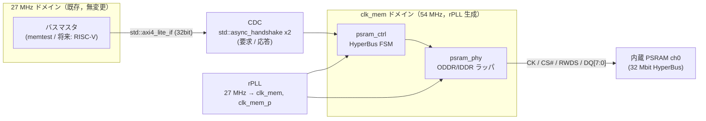

# PSRAM コントローラ設計文書

Tang Nano 9K (GW1NR-LV9QN88PC6/I5) の SIP 内蔵 PSRAM（HyperBus，2x32 Mbit）を
OSS ツールチェーンのみで利用するためのコントローラ設計．
既存資産とツールチェーン pin を変更せず，サブシステム追加として実装する．
検証レイヤの定義・運用規則は [verification.md](verification.md)，
既存デザインは [rtl.md](rtl.md) を参照．

## 方針

- 外部 RTL の引用・流用は行わず，一次資料（データシート・仕様書）から自前実装する
- 既存 OSS 実装（zf3/psram-tang-nano-9k，Apache-2.0）は到達点の目安
  （1:1 クロックで最大 83 MHz）としてのみ参照し，コードは参照しない
- バス IF・CDC は Veryl 標準ライブラリを採用し，自作範囲を
  HyperBus コントローラ FSM・物理層ラッパ・検証用モデルに限定する

## 一次資料

データシート実体は再配布制限のため git 管理外（`docs/datasheets/`，gitignore 済み）に
置き，本表で版数・取得元・SHA-256 を記録する．

| 資料 | 用途 | 取得元 | 版数 | SHA-256 |
| --- | --- | --- | --- | --- |
| Winbond W955D8MBYA datasheet | HyperBus プロトコル・レイテンシ・CR/IR 定義（内蔵ダイは本品のコピーとされる） | winbond.com/resource-files/W955D8MBYA_85C_PKG_datasheet_A01-001_20190605.pdf | A01-001 (2019-06-05) | `a735c54f5b7df8e9b32412eb4d663ba245da9fa37ed32725e70b4f274f8cf14d` |
| Winbond W956x8MBYA datasheet | 同上の 64 Mbit 版（プロトコル同一，補完用） | winbond.com（DL ゲートウェイ経由，利用者取得） | A01-002 (2019-11-13) | `795c6e412890ef3e740150b248e400df5f687c7024a29b9efe1a740983f3a89b` |
| Gowin DS117 (GW1NR Data Sheet) | PSRAM 構成・電気仕様（PSRAM IF は 1.8 V） | cdn.gowinsemi.com.cn/DS117E.pdf | DS117-3.2.4E (2026-03-27) | `5801e4d10d080cec37e1a775dd4a8ce2fbd8ed513eefa1d478dd602bcb5ac313` |
| Gowin UG289 (Programmable IO) | ODDR/IDDR ポート・パラメータ定義 | cdn.gowinsemi.com.cn/UG289E.pdf | UG289-2.2.1E (2025-12-19) | `edec5c97e813e41cfbb6d49ab3bea2a8c8c28b92ec3234c74e865cbd4c88d1db` |
| Gowin UG286 (Clock) | rPLL 分周比・位相シフト設定 | cdn.gowinsemi.com.cn/UG286E.pdf | UG286-2.0.2E (2025-12-19) | `9e047c027228d085a781ccebabfa6094bedabb569103bd750da0cca40d8f0a8d` |
| UG803 (GW1NR-9 Pinout) | PSRAM マジックポートの正式定義 | cdn.gowinsemi.com.cn/UG803E.pdf | UG803-1.6.5E (2025-03-07) | `ebe1350849abb5903c2c934a33d19c27635b50c1b09eee27968fc894f5fef836` |

- W955D8MBYA には新版 A01-002 (2022-09-16) が存在するが，winbond.com の
  ダウンロードゲートウェイ（対話的 DL）経由のため未取得．直接 URL で取得可能な
  A01-001 を採用し，差分が問題になった場合に新版を手動取得する
- UG803 は公式 CDN から正式版を取得済み（旧記載「Scribd 転載 v1.6E のみ確認」を更新）

注: 内蔵ダイの型番は Gowin 非公開であり，W955D8MBYA 相当というのはコミュニティの
解析結果である．spike の IR0 読み出しで製造者 ID・密度を実機確認する．

## アーキテクチャ



`src/psram/subsystem.veryl` は rPLL・CDC ブリッジ・コントローラ・SDR phy・
内蔵パッド配線を `PsramSubsystem` としてまとめる．`Top` と `TopRv` はいずれも
このモジュールをインスタンス化する．機能インターフェースは AXI4-Lite と
初期化状態に限定し，内部クロックは診断用途にだけ公開する．
`Top` 固有の 3 マスタアービタと起動時 memtest はサブシステム外に置くため，
memtest > 画像ローダ > スキャンアウトの優先順位は利用側で決定する．
内部 `clk_mem` の出力は `Top` の周波数確認 LED 専用であり，メモリアクセスには
使用しない．

### クロック

| クロック | 周波数 | 生成 | 用途 |
| --- | --- | --- | --- |
| i_clk | 27 MHz | オシレータ（既存） | バスマスタ側，CDC の片側 |
| clk_mem | 54 MHz | rPLL（位相 0°） | コントローラ FSM，DDR レジスタ |
| clk_mem_p | 54 MHz | rPLL（位相シフト，90° 目安） | CK 出力（データ中央でラッチさせる） |

- 27 MHz 単一ドメイン方針（[rtl.md](rtl.md)）の例外として
  PSRAM サブシステムを追加する．既存モジュールのドメインは変更しない
- Veryl のクロックドメイン注釈により両ドメインは型レベルで区別し，
  交差点は `unsafe (cdc)` ブロック内の `$std::async_handshake` に限定する
  （交差の網羅性は L0 でコンパイラが保証する）
- 54 MHz は既存 OSS 実装の到達点 83 MHz に対する安全側の初期値．
  nextpnr のタイミングモデルの保守性が未知（L3 の限界）のため，
  動作確認後の引き上げは性能改善として別パッチで行う
- 位相シフト量は初期値 90° とし，実機で調整する（L4 残余⑤）

### クロック別タイミング制約（2026-08-23，2026-08-28 更新）

nextpnr の `--freq` は設計中の全クロックに一律の目標周波数を与えるため，
rPLL 出力 clk_mem（54 MHz）が基準クロック（27 MHz）想定で評価されていた．
`nextpnr-himbaechel --sdc` で個別に制約できることを実測で確認し，
`constraints/tangnano9k.sdc` を追加した（`--freq 27` は基準クロック側の
既定値として残す）．2026-08-28 に `Top` を `PsramSubsystem` 利用へ統一したため，
合成後ネット名は `ps_clk_mem` となる．`TopRv` は診断用クロック出力を未使用とし，
サブシステム内部の階層ネット `psram.clk_mem` を制約する．

```
create_clock -name clk_mem -period 18.518 [get_nets ps_clk_mem]
```

適用後のログ（`build/nextpnr.log`）:

```
Info: constraining clock net 'ps_clk_mem' to 54.00 MHz
Info: Max frequency for clock        'ps_clk_mem': 99.27 MHz (PASS at 54.00 MHz)
Info: Max frequency for clock 'blink_alive.i_clk': 43.73 MHz (PASS at 27.00 MHz)
```

実測で判明した注意点:

- **マッチ対象は合成後ネットリストのネット名**である．トップの入力ポート
  `i_clk` のクロックネットは yosys がシンク側の名前（`blink_alive.i_clk`）へ
  改名するため，`[get_ports i_clk]` も `[get_nets i_clk]` もマッチしない
  （`[get_nets blink_alive.i_clk]` ならマッチする）．`clk_mem` は
  Veryl→SV→合成を通じて名前が保たれるためそのまま指定できる
- **マッチしない `create_clock` は警告なく無視される**．制約の空振りは
  「STA が緩いまま通る」形で顕在化しないため，`scripts/synth_pnr.sh` に
  上記 `constraining clock net` 行のログ検査を入れて失格させる．
  SDC のネット名を存在しない名前へ変えた反証テストで検出を確認済み
- 制約違反は nextpnr のエラー（非ゼロ終了）となるため，CI でそのまま失格する

### バス IF: std::axi4_lite_if

- `axi4_lite_pkg::<ADDR_W=22, DATA_W_BYTES=4, ID_W=1>`（ch0 の 4 MB 空間）
- 32 bit データ幅（AXI4-Lite 標準）．コントローラ内部で 16 bit HyperBus
  アクセス 2 回に分割する．WSTRB[3:0] は 16 bit アクセスの
  バイトマスク 2 組へ写像し，全マスク 0 の半語はアクセス自体を省略する
- 単一アウトスタンディング．AW と W は到着順非依存で合流させ，
  両方揃ってから発行する
- 応答は常に OKAY（PSRAM はエラー応答を持たない．初期化未完了時の
  アクセスは ready を落として待たせる）

採用理由: バーストなし単一トランザクションの要件に合致し，
将来の RISC-V (32 bit) 接続にアダプタなしで繋がる．AXI は Arm が仕様公開する
ロイヤリティフリー規格であり，stdlib（MIT OR Apache-2.0）はコンパイラ同梱のため
外部依存も増えない．stdlib API の安定性リスクは
[CONTRIBUTING.md](../CONTRIBUTING.md) の更新手順で扱う．

### CDC: CdcHandshake（自作，2026-07-24 改訂）

- 要求パス（we / addr / wdata / wstrb）と応答パス（rdata）にそれぞれ 1 個使用
- 単一アウトスタンディング前提のため非同期 FIFO は不要
- **当初計画の `std::async_handshake` から自作 `CdcHandshake`
  （src/common/cdc_handshake.veryl，同一のトグルハンドシェイク + 2FF 方式）へ
  変更**．std 部品は内部の reset_sync で導出したリセットを用いており，
  veryl 0.20.2 のネイティブテストでは時刻 0 以前に印加される tb リセットを
  受けられず src ready が初期化されないまま停止する（interpret / cc /
  Verilator すべてで再現）．L1 検証可能性を優先し，リセットを各ドメインの
  FF へ直結する自作実装とした．波形解析では std 部品内部の synchronizer への
  WIDTH=1 指定が効かず 8bit で生成される事象も観測しており（ジェネリクスの
  不具合の疑い），Veryl 更新時に上流状況を再確認する

### コントローラ仕様（v1）

| 項目 | 決定 | 備考 |
| --- | --- | --- |
| 使用チャネル | ch0 のみ | ch1 はポート定義のみ（将来拡張） |
| レイテンシ | 固定レイテンシモード（常に 2x） | CR0 で設定．RWDS 監視による可変判定を省き FSM を単純化．可変化は性能改善パッチ |
| バースト | なし（16 bit 単発 x2） | |
| CK | 差動（CK/CK#，idle: CK=Low/CK#=High） | W955 系は差動クロック入力（データシート §7）．O_psram_ck_n は ~ck を駆動する（旧決定「非駆動固定」をデータシート確認により訂正） |
| 初期化 | 電源投入後 150 µs 待機 → CR0 書き込み → IR0 読み出しで疎通確認 | 待機は 27 MHz カウンタ，IR0 確認は自己診断を兼ねる |

#### コントローラ実装（v1，2026-07-23）

`PsramCtrl`（src/psram/ctrl.veryl，clk_mem 単一ドメイン）として実装済み．

- **初期化**: RESET# パルス（tRP）→ tVCS 待機 → CR0 書き込み（8FEFh =
  IL=3・固定 2x）→ IR0 読み出しで 005Fh を照合（`o_init_ok`）．
  初期化完了まで `o_req_ready` を落として要求を待たせる
- **トランザクションタイミング**（SDR サイクル，cyc0 = CS# assert）:
  CA = cyc1..3，レジスタ書き込みデータ = cyc4（ゼロレイテンシ），
  メモリライトデータ = cyc `3 + 2*IL`（CA 3 クロック目立上り起点，
  spike 実測で確定），ギャップ = CS# High 2 cyc（tRWR 36 ns）
- **リード取り込み**: RWDS 修飾のペア検出．半サンプル列から
  {RWDS=1, 続く RWDS=0} の組を語として取り込むため，phy の IDDR 取り込みが
  位相依存で半サイクルずれても（byte A が Q1 側に載っても）正しく組める．
  タイムアウト時は FFFF を応答（初期化中なら `o_init_ok=0`）
- **32bit 分割**: AXI ワードを 16bit×2 の HyperBus アクセスへ分割．
  WSTRB は RWDS マスク（High=マスク）へ写像し，全マスクの半語は
  トランザクション自体を省略する
- **L1 テスト**（src/psram/test_ctrl.veryl）: SDR 境界 HyperRAM モデル
  （CA 解釈・CR0/IR・固定レイテンシ・64 語メモリ・ライトマスク）に対し，
  初期化 / フルワード W→R / WSTRB 部分書き込み / 半サイクルずれ応答
  （StraddleRead 変種）の 3 テスト
- **AXI4-Lite ブリッジ**（src/psram/axi_bridge.veryl，2026-07-24）:
  `PsramAxiBridge` が s_axi（`$std::axi4_lite_if`，27 MHz 側）の単一
  アウトスタンディング要求を req_t へ束ね，CdcHandshake×2 で ctrl と結ぶ．
  AW/W は到着順非依存で合流し両方揃ってから同時受理，応答は常に OKAY．
  初期化未完了時は ctrl が要求を取らないため AXI 側は応答待ちで自然に
  ブロックされる．L1 テスト（test_axi.veryl）はブリッジ+ctrl+モデルの
  フルスタックで W→R / WSTRB 部分書き込みと初期化前発行のブロックを確認

### プロトコル仕様（W955D8MBYA A01-001 より確定）

出典: W955D8MBYA datasheet §7（CA・Read/Write），§9（Register Space），
§11.2.4・§11.6（タイミング）．W956x8MBYA A01-002 と共通．

**CA（Command/Address）**: CS# アサート後，最初の 3 クロック（6 エッジ，DDR）で
48 bit の CA を CA0[47:40] から 8 bit ずつ MSB first で転送する（CK 中央整列）．

| CA bit | 名称 | 内容 |
| --- | --- | --- |
| 47 | R/W# | 1=Read / 0=Write |
| 46 | AS | 0=メモリ空間 / 1=レジスタ空間 |
| 45 | Burst Type | 0=Wrap / 1=リニア（レジスタアクセスは 1） |
| 44:34 | Reserved | 0 |
| 33:22 | Row Address | システムワードアドレス A20-A9 |
| 21:16 | Upper Column | 同 A8-A3 |
| 15:3 | Reserved | 0 |
| 2:0 | Lower Column | 同 A2-A0 |

32 Mbit = 2M ワード（A20-A0，16 bit/ワード）= 4 MB/ch．AXI 側 22 bit
バイトアドレスの [21:1] をワードアドレスへ写像する（ADDR_W=22 と整合）．

**レジスタ空間**（CA[46]=1）: CA0[47:40] は Read=E0h / Write=60h．
IR0=アドレス 0，IR1=1，CR0 は CA[31:24]=01h・CA[7:0]=00h，CR1 は同 01h．

- レジスタ書き込みはレイテンシ 0（CA 直後に 1 ワード書く．RWDS はホスト非駆動）
- レジスタ読み出しはメモリ読み出しと同じレイテンシ規則（CR0[7:4] と RWDS）

**ID レジスタ（期待値）**: IR0[3:0]=1111b (Winbond)，IR0[6:4]=101b (32Mb)
→ IR0=005Fh，IR1[3:0]=1111b (HyperRAM) → IR1=000Fh．
spike 段 1 の IR0 実読はこの値と照合する．

**CR0**（POR デフォルト 8F1Fh）:

| bit | 名称 | デフォルト | 備考 |
| --- | --- | --- | --- |
| 15 | Deep Power Down Enable | 1 (通常動作) | 0 書き込みで DPD へ |
| 14:12 | Drive Strength | 000 (50Ω) | |
| 11:8 | Reserved | 1111 | 書き込み時も 1111 とする |
| 7:4 | Initial Latency | 0001 (6clk @166MHz) | 1110=3clk @83MHz / 1111=4clk @104MHz / 0000=5clk @133MHz |
| 3 | Fixed Latency Enable | 1 (固定 2x) | 0=可変（RWDS 判定） |
| 2 | Burst Type | 1 (legacy wrap) | |
| 1:0 | Burst Length | 11 (32B) | |

POR デフォルトが固定 2x レイテンシのため，**spike 段 1 は CR0 書き込みなしで
IR0 を読める**（レイテンシ 2x6=12 クロックで固定）．v1 コントローラは
54 MHz ≤ 83 MHz より CR0[7:4]=1110b（3 クロック，2x で 6）へ設定して
CR0[3]=1 を維持する（CR0 書き込み値 8FEFh）．

**タイミング（85°C 品）**:

| 項目 | 値 | 備考 |
| --- | --- | --- |
| tVCS | 150 µs | 電源投入/リセット後，初回アクセスまでの待機（設計の 150 µs 待機の根拠） |
| tRP | 200 ns min | RESET# パルス幅 |
| tCSM | 4 µs max | CS# Low 連続時間上限（リフレッシュ確保） |
| tRWR | 36 ns min | Read-Write Recovery（CS# 立ち上げ後の回復） |
| tACC | 36 ns min | 初期アクセス（レイテンシクロック数はこれを満たすよう選ぶ） |
| tCSS / tCSH | 2 ns / 0 ns min | CS# セットアップ/ホールド（対 CK エッジ） |
| tCSHI | 6 ns min | トランザクション間の CS# High 期間 |

### 物理層（psram_phy）

実装: `PsramPhy`（src/psram/phy.veryl，2026-07-23）．
FSM 側の SDR インタフェース（1 サイクル = 1 CK，A=立上り側 / B=立下り側）を
DDR パッド信号へ変換する．

**注（2026-07-30）**: L4 切り分けの結果（「SDR fallback phy と実機 PASS」節），
現行 Top は本 DDR phy ではなく `PsramPhySdr`（後述）を使用する．本 DDR phy は
apicula IOLOGIC の実例調査後の復帰候補としてソースと verif 検査を残置している．

- Gowin プリミティブ ODDR / IDDR / IOBUF を `$sv::` 名前空間で明示
  インスタンス化する（blackbox スタブ `src/gowin_prims.sv`，UG289 準拠）
- **全出力パッド（CK/CK#/CS#/RESET#/DQ/RWDS）を ODDR 経由**とし，出力
  パイプライン段数を構成的に一致させる（CS#/RESET# は D0=D1 の SDR 運用．
  ODDR の内部段数の絶対値に依存しない = 段数解釈の共通モード誤りを排除）
- CK/CK# は clk_mem_p（+90°）の ODDR によるクロックフォワーディングで生成．
  データ（clk_mem 側）に対する 90° 関係は PLL の PSDA_SEL のみで決まり，
  位相調整が単一変数になる（L4 残余⑤）．ck_en は clk_mem で 1 段受けてから
  clk_mem_p ODDR へ渡す（T/4 ≈ 4.6 ns 予算の同一 PLL 位相差経路）
- 入力（DQ/RWDS）は clk_mem の IDDR で取り込む（Q0=立上り / Q1=立下り）
- FSM 側入力はすべて 1 段レジスタで受ける．CK パス（clk_mem_p の ODDR）が
  構造上 1 サイクル遅れるため，データ/CS 側にも同じ 1 段を入れて
  SDR サイクルの同時性を保つ（コントローラ実装時に整合を修正）
- DQ/RWDS のトライステートは ODDR の TX→Q1 を IOBUF の OEN へ接続する
  専用経路で制御する（yosys-slang の tristate 推論は z を don't-care へ
  畳み込み使用不可 — spike 実装時に PnR 結果検査で確認済み）
- 注意: ODDR の INIT は 1'b0 固定のため，コンフィグ直後〜FSM 駆動開始まで
  CS#=0/RESET#=0 がパッドへ出る．RESET#=0 が RAM をリセットに保持するため
  無害だが，FSM は必ず RESET# パルス→tVCS 待機から開始すること
- Apicula 対応状況（Wiki 2024-11-19 版）: ODDR/ODDRC/IDDR/IDDRC/rPLL 対応，
  IODELAY 系は未対応（本設計は不使用）
- **単体実証と接続検査（`verif/psram_phy/`，2026-07-23 実施）**:
  `run.sh` が probe トップの合成→PnR→ネットリスト機械照合
  （`check_netlist.py`）を行う．検査項目は (1) bit ごとの
  ODDR.Q0→IOBUF.I / ODDR.Q1→OEN / IOBUF.O→IDDR.D 接続，(2) bit i ↔
  sip_cst パッド位置の対応（ビット入れ違い検出）と IOLOGIC I/O 側の整合，
  (3) ODDR/IDDR のクロック接続（CK 系=CLKOUTP，データ系=CLKOUT）．
  `$sv::` インスタンスの繋ぎ忘れ・取り違えは Veryl/L0 では検出されない
  ため，この検査をリグレッションに含める（CI の verif ジョブ /
  ローカルは `.\scripts\verif.ps1`）．検査自体の有効性は
  OEN 直結の変異を入れて 8 bit 全数で FAIL することを確認済み．
  全 PSRAM パッドで IOBUF@IOB + ODDR@IOLOGIC*O + IDDR@IOLOGIC*I の配置
  （**同一パッドでの ODDR/IDDR 同居**を含む）と
  clk_mem/clk_mem_p のグローバル配線も同 probe で確認済み

### パッドマッピング（確認済み 2026-07-22）

pin 済みコンテナ（OSS CAD Suite 2026-07-20，apycula 0.33.dev19+gdfb3c8702）で
以下を確認した:

- Apicula chipdb `GW1N-9C.msgpack.xz` の `sip_cst['GW1NR-9C']['QFN88P']` に
  PSRAM マジックポート 26 本すべてが定義されている（下表）
- **制約方法**: トップモジュールのポート名をマジックポート名と一致させるだけでよい．
  `.cst` への記載は不要で，nextpnr-himbaechel
  （`--device 'GW1NR-LV9QN88PC6/I5' --vopt family=GW1N-9C`）が chipdb から
  自動で該当ダイ IO へ配置する（実証: マジックポートを持つ最小 SV で
  PnR を実行し，全 26 パッドの配置が sip_cst の定義位置と一致）
- gowin_pack は sip_cst 該当パッドを IO standard 設定対象から除外して処理する
  （`is_ram_pin`）．bitstream 生成まで成功
- 全パッドはダイ左端列（X0）に位置し，UG803 由来の BANK3 系という推定と整合する

| ポート | ダイ IO | ポート | ダイ IO |
| --- | --- | --- | --- |
| O_psram_ck[0] | X0Y7/IOBA | O_psram_ck[1] | X0Y22/IOBB |
| O_psram_ck_n[0] | X0Y6/IOBA | O_psram_ck_n[1] | X0Y22/IOBA |
| O_psram_cs_n[0] | X0Y5/IOBB | O_psram_cs_n[1] | X0Y21/IOBA |
| O_psram_reset_n[0] | X0Y1/IOBA | O_psram_reset_n[1] | X0Y17/IOBA |
| IO_psram_rwds[0] | X0Y16/IOBA | IO_psram_rwds[1] | X0Y26/IOBB |
| IO_psram_dq[0] | X0Y1/IOBB | IO_psram_dq[8] | X0Y17/IOBB |
| IO_psram_dq[1] | X0Y2/IOBA | IO_psram_dq[9] | X0Y19/IOBA |
| IO_psram_dq[2] | X0Y2/IOBB | IO_psram_dq[10] | X0Y19/IOBB |
| IO_psram_dq[3] | X0Y3/IOBA | IO_psram_dq[11] | X0Y20/IOBA |
| IO_psram_dq[4] | X0Y8/IOBA | IO_psram_dq[12] | X0Y23/IOBB |
| IO_psram_dq[5] | X0Y13/IOBA | IO_psram_dq[13] | X0Y24/IOBA |
| IO_psram_dq[6] | X0Y15/IOBA | IO_psram_dq[14] | X0Y25/IOBA |
| IO_psram_dq[7] | X0Y16/IOBB | IO_psram_dq[15] | X0Y26/IOBA |

ツールが正しいビットストリームを生成するか（配線・ファンクションの実体）は
L4 の残余であり，spike 段 1 で確認する．

## 検証

レイヤ定義は [verification.md](verification.md) に従う．本節は PSRAM 固有の割当を示す．

### L4 でしか反証できない項目（spike の存在理由）

1. **Apicula のパッドマッピングの正しさ**: マジックポート
   （`O_psram_ck[1:0]`，`O_psram_ck_n[1:0]`，`IO_psram_rwds[1:0]`，
   `IO_psram_dq[15:0]`，`O_psram_reset_n[1:0]`，`O_psram_cs_n[1:0]`）の制約が
   正しいビットストリームになるか．L0-L3 は「ツールが受理したか」までしか見えない
2. **rPLL の実機挙動**: 設定→実周波数・lock・位相の対応（cells_sim の PLL モデルは
   理想化されており反証力がない）
3. **内蔵ダイの正体**: W955D8MBYA 相当説の真偽．IR0 実読が唯一の一次情報であり，
   L1 モデルの解釈誤り（共通モード誤り）に対する唯一のクロスチェック点
4. **電源投入実挙動**: 150 µs 待機・CR デフォルト値・リセット系列の現実
5. **タイミングの現実**: 位相シフト量の適否，54 MHz 動作余裕

### spike の構成（1 実験 1 未知変数の適用）

- **段 1: bit-bang 疎通**（PLL・DDR プリミティブ不使用）— 上記 1・3・4 を潰す
  - 27 MHz ロジックから CK を FSM で直接生成（27/4 = 6.75 MHz）．
    CK をデータ遷移に対し 1 サイクル遅らせ，構成的に 90° 相当の関係を作る
  - 制約: CS# Low 期間上限 tCSM（約 4 µs，リフレッシュ確保）があるため，
    これより遅い CK は不可．レジスタリード 1 トランザクション
    （約 17 CK ≈ 2.5 µs @ 6.75 MHz）は規格内
  - IR0 読み出し結果を UART / LCD へ表示
- **段 2: rPLL 単体実証** — 上記 2 を潰す
  - rPLL を手動インスタンス化し，54 MHz でカウンタを回し LED 点滅周期で
    周波数を目視確認，lock 信号も表示
  - 実装: PsramClkGen（src/psram/clkgen.veryl．IDIV=1/FBDIV=2/ODIV=16，
    VCO 864 MHz，CLKOUTP は +90° 設定で phy パッチ用に確保）．
    leds[1] が clk_mem 換算 1 Hz 点滅（27 MHz 基準の leds[0] と周期比較），
    leds[2] が lock 表示（[rtl.md](rtl.md) の LED 割当表）
- 5（位相）は 1〜4 が既知になった後，phy パッチで単一変数として扱う

### spike 段1 実機結果（2026-07-22）

SRAM ロード直後の UART 出力（実機，Tang Nano 9K）:

```
PSRAM IR0=005F IR1=000F CR0=8F1F L=0B W=1
```

- **IR0=005F**: Manufacturer=1111b (Winbond)，Density=101b (32 Mbit)．
  内蔵ダイの W955D8MBYA 相当説と整合（上記 L4 項目 3 を解消）
- **IR1=000F**: Device Type=HyperRAM
- **CR0=8F1F**: POR デフォルトがデータシートどおり（固定 2x・IL=6）
- **W=1**: CA 期間中 RWDS High（固定レイテンシ表示）
- パッドマッピング（ポート名一致の自動配置）が実機で機能（L4 項目 1 を解消），
  RESET# パルス + 200 µs 待機の電源投入系列で正常応答（L4 項目 4 を解消）
- **L=0B**: byte A 検出は CS# assert から 14 CK 目（0-based）＝
  **レイテンシは CA 3 クロック目（CA[15:0] 取り込みエッジ）の立上りを起点**に
  2×IL を数える．「CA 終了後から 2×IL」とする当初解釈より 1 CK 早い．
  L1 モデル（HyperRamRegReadModel）へ反映済み．コントローラ FSM 設計は
  この起点を採用する

#### memtest と Top 統合（パッチ #7，2026-07-24）

- `PsramMemtest`（src/psram/memtest.veryl）: AXI4-Lite マスタとして Words 語
  （既定 1024）をアドレス関数パターンで書き込み→読み返し照合し，
  `PSRAM INIT=x MEMTEST=PASS/FAIL ERR=xxxx` の 1 行を UART/LCD へ報告する
- Top を spike 配線から phy + ctrl + bridge + memtest のサブシステムへ切替．
  spike モジュール（PsramSpikeBitbang / PsramClkGen の LED 表示）は
  L1 テスト付きで残置し，clkgen と LED 割当（leds[1] 周期比較 / leds[2] lock）
  は継続使用する
- Top 統合後の PnR で phy プリミティブ（ODDR 13 / IDDR 9 / IOBUF 18 / rPLL 1）
  の正規パッド配置を確認済み
- **実機結果（2026-07-24，SRAM ロード直後の UART）**:
  `PSRAM INIT=0 MEMTEST=FAIL ERR=0400` — IR0 照合失敗 + 全 1024 リードが
  タイムアウト応答（FFFF）．L1 全通過に対する L4 固有の失敗であり，
  残余⑤（DDR/位相の実挙動）の領域．未検証の疑い順に:
  1. ODDR の D0/D1 半サイクル割当の解釈（誤りなら CA バイト順が崩れ全滅する．
     UG289 のタイミング図は本文テキストから抽出できておらず未確認）
  2. CR0 書き込みのタイミング崩れによる誤書き込み（DPD ビット 0 で
     Deep Power Down に入ると全応答が消える）
  3. CK 位相（PSDA_SEL）とリード取り込みの整合
  切り分けは 1 実験 1 未知変数で: (a) CR0 書き込みスキップ変種で 2 を除外 →
  (b) D0/D1 スワップ変種で 1 を判定 → (c) PSDA_SEL 掃引で 3 を調整
- **切り分け実験の結果（2026-07-24 実施，全て同一の失敗 INIT=0/ERR=0400）**:
  - (a) CR0 書き込みスキップ（PsramCtrl の WriteCr0=0 ノブ，POR IL=6 のまま）
    → 変化なし．**CR0 誤書き込み → DPD 説を棄却**
  - (b) 全 ODDR の D0/D1 と IDDR の Q0/Q1 をスワップ → 変化なし．
    **半サイクル割当の解釈誤り説を棄却**（単独原因としては）
  - (e) CK 生成を clk_mem_p から clk_mem の ODDR（D1=en，180° 位相）へ変更
    → 変化なし．**CLKOUTP 死亡説・位相依存説を棄却**
  - (h1) CS#/RESET# を ODDR からファブリック FF 直結（spike 実証済み経路，
    CS# は +2cyc 遅延で整合）へ変更 → 変化なし．**CS#/RESET# 固着説を棄却**
  - 残る共通要素は **DQ/CK/RWDS の ODDR / IDDR / IOBUF(OEN=ODDR Q1) の
    bitstream 実挙動**．gowin_pack は IOLOGIC の INIT 属性を未処理として
    スキップしており（`XXX IOLOGIC` メッセージ，値はデフォルト 0 のため
    それ自体は無害の可能性），apicula の GW1N-9C IOLOGIC 対応の実績確認が必要
  - 次の判定実験: ODDR/IDDR を使わない SDR fallback phy
    （CK をファブリック生成，spike 方式の一般化）．これが動けば
    「ロジック正・IOLOGIC bitstream 化が原因」とほぼ確定し，apicula の
    実例調査（gowin_unpack での fuse 比較・upstream examples 突合）へ進む
    → **実施済み（下記，実機 PASS）**
- **追加の切り分け実験（2026-07-24 深夜〜2026-07-30）**:
  - (x)〜(x3) OE 段数測定: bit-bang 比較測定で ODDR の TX→Q1(OEN) 経路の
    FF 段数がデータ (D0/D1→Q0) 経路より **1 段少ない（K=1）ことを実機確定**．
    OEN イベントがデータより 1 サイクル先行し最終バイトが High-Z で失われる
    ため，phy 側に OE 専用の追加 1 段（dq_oe_q2 / rwds_oe_q2）を入れて
    再均衡する（恒久修正として phy.veryl へ採用済み）．ただしこの修正
    単独では INIT=0/ERR=0400 は解消しなかった
  - (y) clk_mem 27 MHz（半速）ビルド / (z1) D0/D1 半サイクル入替仮説ビルド:
    セッション中断により実機結果は未記録（変更は撤去済み．(z1) は実験 (b)
    で単独原因としては棄却済みの仮説の再検証だった）
  - (z2) CLKOUTP 生死判定（2026-07-30 実施）: CLKOUTP でトグル FF を駆動し
    27 MHz 側で 2FF 同期・エッジ計数する一時デバッグ構成（パッド・IOLOGIC
    不使用）で `PLLP N=FE6B`（65536 サイクル窓中 65131 遷移 ≈ 毎サイクル
    検出）→ **CLKOUTP は生存・トグル**．実験 (e) の棄却結果と整合し，
    容疑は IOLOGIC bitstream 実挙動のまま

#### SDR fallback phy と実機 PASS（2026-07-30）

上記の判定実験を恒久実装として行い，実機で memtest 全通過を得た:

```
PSRAM INIT=1 MEMTEST=PASS ERR=0000
```

- 構成: `PsramPhySdr` / `PsramPhySdrCore`（src/psram/phy_sdr.veryl）．
  ODDR/IDDR（IOLOGIC）を使わず，ファブリック FF と IOBUF のみで HyperBus を
  駆動する．1 CK = i_clk（27 MHz）の 4 位相（CK 6.75 MHz）で，DQ/RWDS は
  CK エッジに対し 90°（1 位相 = 37 ns）オフセットで駆動し，リードは CK
  エッジの 1 位相後に平 FF で取り込む（spike 段 1 と同一の電気的条件の一般化．
  FSM へは 1 SDR サイクル遅れで (A,B) ペアを提示 — ctrl のペア検出は遅延不変）
- `PsramCtrl` へ位相イネーブル `i_en` を追加し 1/4 レートで歩調を合わせる
  （「1 サイクル = 1 CK」の意味を保存．既存 L1 テストは i_en=1 で不変）．
  全速 CdcHandshake との req/rsp 授受は `o_req_ready` / `o_rsp_valid` を
  i_en で修飾して同期させる（非イネーブルサイクルでの取りこぼし・二重送信
  防止．ctrl.veryl / top.veryl のコメント参照）
- サブシステム全体を i_clk 単一ドメインへ変更（rPLL は LED 表示のみに残置）．
  `TimeoutCyc=24` へ短縮（タイムアウト経路でも CS# Low ≤ 3.6 µs < tCSM 4 µs）
- 実機結果: CR0 書き込み（IL=3）を含む初期化・IR0 自己診断・1024 語の
  ライト/リード照合が全通過（帯域は DDR 54 MHz 比 1/16 の実験構成）
- **L4 帰結**: コントローラ/ブリッジ/memtest/プロトコル解釈は実機で正しく，
  DDR 版の失敗要因は **ODDR/IDDR/IOBUF(OEN=ODDR Q1) の bitstream 実挙動に
  ほぼ確定**．DDR phy への復帰は apicula の実例調査（gowin_unpack での
  fuse 比較・upstream examples 突合，IOLOGIC INIT 未処理の確認）の後に検討する
- L1: パッドレベル統合テスト `test_psram_phy_sdr_init`
  （HyperRamRegReadModel を 4 位相 CK へオーバーサンプル接続し，
  初期化シーケンスと CA の A/B 位相割当を検証）を追加

**54 MHz 化（2026-07-31）**: PSRAM サブシステム（phy/ctrl・ブリッジ mem 側）を
i_clk（27 MHz）から clk_mem（rPLL 54 MHz）駆動へ変更し **CK 13.5 MHz**（帯域
2 倍）で実機 memtest 全通過を確認した．ブリッジ内 CdcHandshake の実クロック
交差（27↔54 MHz）もこの構成で実機検証された．`TimeoutCyc=24`（74 ns/CK で
1.8 µs < tCSM）．STA は clk_mem Fmax 106 MHz > 54 MHz（nextpnr --freq 27 の
一律評価だが実測 Fmax で確認）

**`Top` の共通サブシステム化後の回帰確認（2026-08-29）**:
`build/top.fs` を Tang Nano 9K（IDCODE `0x100481b`）の SRAM へ書き込み，
COM4（115200 bps）で次を確認した．

```
PSRAM INIT=1 MEMTEST=PASS ERR=0000 K=00000 RD=00000000
IMG OK
```

初期化・IR0 照合・1024 語 memtest・TF カードから PSRAM への画像ロードは
共通化前と同じく成功し，UART エコーも正常だった．LCD の表示内容と
周波数確認 LED の周期・PLL lock 表示は目視確認項目として残す．

#### apicula ODDR 実挙動の調査（実験 w 系，2026-07-30）

DDR phy 復帰に向け，IOLOGIC の bitstream 実挙動を fuse 解析と
チップ内ループバック（一時デバッグモジュール，UART 報告）で調査した．
ログは build/psram_probe/（gitignore 領域），一時 RTL は判定後に削除済み．

**静的解析（w1）**:

- gowin_unpack で SIP パッド版/通常ピン版の bitstream を復元比較．
  ODDR 13 個は両者で復元されるが IDDR は両者とも 0 個
  → unpack の IOLOGIC 復号が `OUTMODE` 優先の elif 構造のため，
  **同一パッドに ODDR+IDDR が同居すると IDDR が表示されない**（表示上の問題）
- gowin_pack の計装で IDDR も INMODE=IDDRX1 ほかの fuse を出力していること，
  ODDR+IDDR 同居時の個別 OR エンコードが属性和集合での一括計算と一致する
  ことを確認（pack のモード fuse は正常）
- PLL の PHASE/DUTY fuse も表どおり（unpack の PSDA_SEL="0111" 復元は
  PHASE=4..7 が高位ビット fuse を共有することによる復号縮退で，
  bitstream は設計値 PHASE=4 = +90° を保持）

**ループバック実証（w2 系，DQ パッド上，RAM は RESET#=0/CS#=1 で非活性）**:

| 実験 | 構成 | 結果 |
| --- | --- | --- |
| w2 | ODDR+IDDR 同一パッド / IDDR 単体 / ODDR 単体（27 MHz osc） | 全経路動作 |
| w2b | 同上，IOLOGIC クロックを rPLL CLKOUT 54 MHz へ | 全経路動作 |
| w2c | さらに CLKOUTP 駆動 ODDR クロック転送を追加（2 クロック混在） | 全経路動作 |
| w9 | DQ 全 8 bit 静的パターン（A5/5A） | 全 bit 正常（半サイクル入替枠で取得） |

**DDR phy 実機スイープ（すべて INIT=0/ERR=0400 で FAIL）**:
54 MHz + OE 再均衡（w3）／27 MHz 半速（w4）／PSDA=0000／
CK をファブリック LUT ゲート化（w6）／OE 補正 K=2, K=-1（w7）

**転回点（w8）**: 出力専用パッド（CK/CK#/CS#/RESET#）をファブリック駆動へ
変更し DQ/RWDS のみ IOLOGIC とした構成で **INIT=1** を初達成．ただし
memtest は全滅し，診断追加（memtest の K/RD 報告）で
`K=00000 RD=005F005F` = **全メモリリードが IR0 の値を返す**ことを観測．

**根本原因（w9d/w9e，CK ゲート出力を RWDS パッド経由で同一フレーム観測）**:

```
DQ 半サイクル列:  Z Z Z Z 00 00 00 00 11 22 33 44 55 66 77 88 99 99 99 99 Z
CK パルス:                 ^1    ^2    ^3   （データより約 2.5 サイクル先行）
```

- **apicula ODDR のデータ/OE 経路はファブリック基準で約 2.5 サイクル遅延**
  （文書仕様の 1 サイクルと乖離）．CK 経路（ファブリック / CLKOUTP 直系）が
  先行するため，RAM は CA 窓を先取りし先頭バイトが High-Z（FF）となる．
  FF は CA47:46:45=111（レジスタ空間リニアリード）と解釈され，全アクセスが
  IR0 リード化する — INIT=1（偶然成立）・RD=005F005F・書き込み消失・
  ERR=0400 のすべてを説明する
- 定常状態の直列化順序は正しい（11,22,...,99）が，D0 は立下り半サイクル・
  D1 は次の立上り半サイクルに現れる（半サイクルずれた枠）
- バースト末尾で最後の D1 バイトが欠落し最終 D0 が 4 半サイクル反復される
  （TX 遷移が入力サンプリングを先に停止する挙動とみられる）
- 旧実験 (a)(b)(e)(h1) はすべて OE 未修正状態での実施で交絡していた．
  また「K=1」の OE 段数補正は CA 送出には有効（w8 で CA 成立）

**帰結と DDR 復帰の方針**:

1. 出力専用制御パッド（CK/CK#/CS#/RESET#）はファブリック駆動とする
   （w8 実証済み．CK は CLKOUTP の LUT ゲートでグリッチフリーに生成可能）
2. DQ/RWDS の ODDR は実測遅延（約 2.5 サイクル・半サイクル枠）を前提に
   ck_en を +2 サイクル遅延・PSDA を再選定して補償する（要実機スイープ）
3. バースト末尾の D1 欠落は OE/データ保持の 2 サイクル延長で回避する
4. 並行して upstream（apicula）へ ODDR 実挙動の報告を検討する
   （本節の測定データを添付可能）

**遅延補償 DDR phy の試行（実験 w10 系，2026-07-31，未解決のため保留）**:

上記方針の補償（D1=byte A(1 段)/D0=byte B(2 段) の再マップ，ck_en 遅延，
CS#/RESET# ファブリック化，OE 閉端延長）を実装し 27 MHz で試行した．

- ループバック再測定（w10d）: **再マップは意図どおり機能**し，ペア (A,B) が
  同一サイクルの正しい半サイクル（A=立上り側/B=立下り側）に整列，CK ゲートの
  立上り 90° が byte A スロット中央に一致することを確認．CK マークは
  データより 1 サイクル先行（→ ck_en_q5 が整列解）
- しかし memtest は ck_en_q3/q4/q5（CS#/OE も整合させて）いずれも
  INIT=0/RD=FFFFFFFF（RAM 全無応答）．ループバック上の整列と実 RAM の
  受信の間に未特定の不一致が残る（候補: 実 CK パッド（OBUF）とプローブ
  経路（IOBUF+IDDR）の遅延差，CS# とデータの相対など未測定の自由度）
- 時間対効果から DDR は保留とし，**SDR phy の clk_mem 54 MHz 駆動
  （CK 13.5 MHz，帯域 2 倍）へ切替**して実機 PASS を確認した
  （「SDR fallback phy と実機 PASS」節の 54 MHz 化）．
  再開時は本節の測定ハーネス（w9d/w10d 方式）で CS#・CK 実パッドを含む
  全信号の同時観測から始めるのが良い

### spike 段2 実機結果（2026-07-22）

- leds[1]（clk_mem 54 MHz 換算 1 Hz）が leds[0]（27 MHz 基準 1 Hz）と同周期で
  点滅し，**rPLL 設定（IDIV=1/FBDIV=2/ODIV=16）→ 実周波数 54 MHz** を確認
- lock 表示（leds[2]）は常時点灯（上記 L4 項目 2 を解消）
- 残る L4 項目は 5（位相シフト量の適否）のみ．phy パッチで単一変数として扱う

### L1: 自作ビヘイビアモデルとテスト

- モデル（すべて Winbond データシート・Gowin UG289 起点で実装，外部コードの引用なし）:
  HyperRAM（CA 解釈・レイテンシ・リード/ライト応答・CR/IR）
- **割当の改訂（2026-07-23）**: プリミティブを含む PsramPhy はネイティブ
  テストでシミュレーション不能（blackbox）のため，当初計画の
  「ODDR/IDDR 等価モデル」は廃し，L1 は **phy の SDR 境界**へ SDR 版
  HyperRAM モデルを接続してコントローラを検証する．phy 内部の配線の
  正しさは L2 相当の合成後ネットリスト検査（PnR 結果の配置・接続確認）と
  L4（コントローラ初期化時の IR0 読み出し自己診断）へ割り当てる
- テスト: 初期化シーケンス / 単発リード / 単発ライト / WSTRB 部分書き込み /
  レイテンシ境界 / CDC 往復

### L1F: formal 適用先（試験導入）

安全性プロパティを sby（BMC + k-induction）で検証する:

- CS# Low 期間 ≤ tCSM（サイクル数上限）
- CK は CS# Low 中のみ遷移する
- リードデータフェーズ中に DQ 出力イネーブルが立たない（バス競合なし）
- レイテンシカウントの正確性
- AXI4-Lite: valid は ready 前に deassert しない / 要求なき応答の不在 /
  単一アウトスタンディング不変条件
- 初期化完了前にメモリアクセスが発行されない

ハーネスは `formal/` 配下の独立 SV + sby 設定（[verification.md](verification.md) 参照）．

## パッチ計画

| # | branch / commit | 内容 |
| --- | --- | --- |
| 0a | `docs: reorganize documents into readme, design, and contributing` | 文書再編（README / docs/ 設計一式 / CONTRIBUTING の 3 分類化） |
| 0b | `docs: add verification policy document` | verification.md 新設 |
| 1 | `docs: add PSRAM controller design document` | 本文書 |
| 2 | `feat: add psram pad access spike` | 段 1（bit-bang IR0 読み出し）+ 段 2（rPLL 単体）の 2 コミット |
| 3 | `feat: add psram phy layer` | ODDR/IDDR ラッパ + 検証用モデル + 位相調整 |
| 4 | `feat: add psram controller` | 初期化 / R/W FSM / AXI4-Lite / CDC |
| 5 | `test: add hyperram behavioral model and controller tests` | HyperRAM モデルとネイティブテスト |
| 6 | `test: add formal properties for psram controller` | formal ハーネス（試験導入） |
| 7 | `feat: add psram memtest` | 実機デモ（UART/LCD 報告） |
| 8 | `feat: add sdr fallback phy` | IOLOGIC 切り分けの恒久実装．実機 memtest PASS 構成（「SDR fallback phy と実機 PASS」節） |

## 残課題・リスク

| 項目 | 内容 | 対応 |
| --- | --- | --- |
| PSRAM マジックポートの制約方法 | 内蔵パッドを nextpnr-himbaechel / .cst でどう指定するか未確認 | **解決（2026-07-22）**: ポート名一致による自動配置を PnR で実証（「パッドマッピング」節）．実機疎通は spike (#2) で確認 |
| nextpnr タイミングモデル | Gowin EDA との保守性差が未知 | 54 MHz の安全側初期値で開始 |
| nextpnr のクロック別制約 | `--freq` は全クロック一律で，clk_mem (54 MHz) の STA が 27 MHz 想定で評価される | **解決（2026-08-23）**: `--sdc` で clk_mem のみ個別制約（「クロック別タイミング制約」節） |
| sby の同梱確認 | pin 済み OSS CAD Suite 2026-07-20 での同梱未確認 | **解決（2026-07-22）**: sby と SMT ソルバ群の同梱を確認（[verification.md](verification.md)） |
| 内蔵ダイの仕様差 | W955D8MBYA 相当は非公式情報 | IR0 の実機読み出しで確認し，本文書に結果を記録 |
| CR0 デフォルト値 | 電源投入時のレイテンシ初期値に依存した初期化順序 | **解決（2026-07-22）**: POR デフォルトは固定 2x・6 クロック（8F1Fh）．CR0 書き込み前でもレイテンシは決定的（「プロトコル仕様」節） |
| apicula ODDR 実挙動 | データ/OE 経路が約 2.5 サイクル遅延し CK 経路と乖離（**根本原因特定済み 2026-07-30**，「apicula ODDR 実挙動の調査」節） | 制御パッドのファブリック化 + ck_en 遅延補償で DDR 復帰可能な見込み（要実機スイープ）．upstream への報告を検討 |
