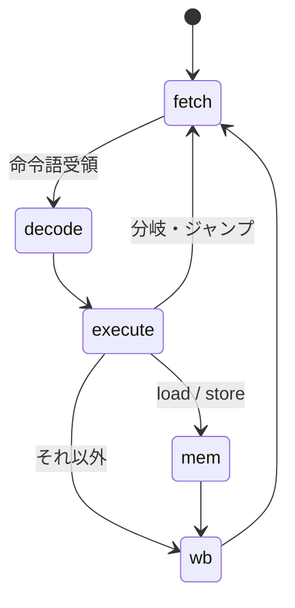

# RISC-V ソフトコア設計文書

Tang Nano 9K 上で動作する RV32I ソフトコアを自前実装し，既存のペリフェラル
（UART / TF カード / LCD / PSRAM）をメモリマップドで束ねてプログラムを走らせる．
検証レイヤの定義・運用規則は [verification.md](verification.md)，
既存デザインは [rtl.md](rtl.md) を参照．

## 方針

- 公開されている RISC-V 仕様のみから自前実装する．既存 OSS 実装
  （PicoRV32・VexRiscv・CVA6 等）はコードを参照しない．RISC-V ISA は
  RISC-V International がロイヤリティフリーで仕様公開しており，
  仕様からの独自実装に権利上の問題はない
- **Linux は目標としない**（下記「Linux を目標にしない理由」）．
  到達点は「自作コアが SD カードからプログラムをロードし，LCD へ描画する」
- 既存サブシステムは作り直さず，メモリマップドペリフェラルとして再利用する．
  ハードコードした FSM（Fat32Reader・TfImageDemo・PsramMemtest）は
  段階的にソフトウェアへ移し，その分の LUT をコアへ振り替える
- 検証はレイヤを分け，riscv-tests を「実装から独立したオラクル」として使う

### Linux を目標にしない理由

実測値に基づく判断である．

| 制約 | 実測 | 含意 |
| --- | --- | --- |
| PSRAM 実効帯域 | 2.25 MB/s（[tfcard.md](tfcard.md)「帯域の制約と解像度の決定」） | 命令フェッチだけで上限 約 0.56 MIPS．データアクセス込みで半減 |
| PSRAM 容量 | ch0 4 MB のみ配線（SIP 全体で 2ch x 4 MB = 8 MB） | MMU 付き Linux には不足（実質 32 MB 以上が目安） |
| LUT4 | 6656 / 8640（77%，画像デモ構成） | 空き約 1980．MMU + キャッシュ + コアは載らない |

バーストと DDR 復帰で帯域は改善できる（線形バーストで約 23 MB/s，DDR で更に倍）が，
容量の制約は動かせない．nommu Linux は 8 MB クラスの実績があるものの，
比較対象（K210 等）は数百 MHz・SRAM 直結であり，27 MHz・PSRAM 経由の本構成とは
体感が桁違いになる．よって OS 的な目標は段階 11 到達後に再評価する．

## 一次資料

仕様書の実体は git 管理外（`docs/datasheets/`）に置き，本表で版数・取得元・
SHA-256 を記録する（[psram.md](psram.md) と同じ運用）．

| 資料 | 用途 | 取得元 | 版数 | SHA-256 |
| --- | --- | --- | --- | --- |
| RISC-V Instruction Set Manual（Unprivileged + Privileged 合本） | RV32I / M 拡張の命令定義・符号化，CSR・トラップ（段階 9 以降） | github.com/riscv/riscv-isa-manual/releases/download/riscv-isa-release-fcd15c1-2026-08-18/riscv-spec.pdf | release `riscv-isa-release-fcd15c1-2026-08-18`（commit fcd15c1） | `f2c7cb4940f5d49762e2b82a5e898e8d7caea398c17aec4a55b11516ae4af6bf` |

SHA-256 は GitHub Releases API のアセット digest と照合済み（OSS CAD Suite / Veryl と
同じ pin 方式．上流に署名はないため，この pin が保証するのは転送路改竄と
pin 後の変更の検出まで）．

RISC-V の仕様書は日次ビルドで公開されており「版数」に相当するのはリリースタグである．
RV32I と M 拡張は批准済みで内容は変わらないため，引用可能な特定スナップショットを
固定する方針とした．

## ISA スコープ

| 段階 | 内容 |
| --- | --- |
| v1 | RV32I（基本整数命令）．M モードのみ |
| v2 | M 拡張（乗除算）**実装済み** |
| v3 | Zicsr・トラップ・割り込み（CLINT: mtime / mtimecmp，mstatus / mie / mip / mtvec / mepc / mcause / mtval / mscratch）**実装済み** |

**非対応**（現時点）: 圧縮命令 C・A 拡張・F/D 拡張・MMU（Sv32）・U/S モード・
PMP・デバッグトリガ・Zicntr（`mcycle` / `minstret`）・
**非整列アクセスのハードウェア対応**（例外送出で代替．下記）．
C 拡張はコードサイズが BSRAM 容量に直結するため，段階 8 以降で費用対効果を再評価する．

## マイクロアーキテクチャ

**多サイクル（非パイプライン）** の FSM とする．

- メモリが律速（0.56 MIPS 相当）であり，パイプライン化の利得が小さい
- 面積が最小．LUT の空きが限られる本ボードでは支配的な判断材料になる
- 1 命令 = 1 トランザクション境界で状態が観測でき，L1 検証が単純になる



### メモリインタフェース

コアとメモリは 1 アウトスタンディングの簡易プロトコルで結ぶ．

- コアが `o_mem_valid` を上げ，アドレス・書き込みデータ・バイトイネーブルを保持する
- メモリは受理した次のサイクルに `i_mem_done` を 1 サイクル上げ，
  リードならこのとき `i_mem_rdata` が有効
- コアは `i_mem_done` で `o_mem_valid` を下ろす

`RvMem` はバイトイネーブルのために 8 bit 幅の RAM を 4 面並べる
（`$std::ram` はバイトイネーブルを持たない）．`BUFFER_OUT: true` の登録読み出しに
することで BSRAM へ載る（`false` は組合せ読み出しになり分散 RAM になってしまう）．

`i_dbg_*` はテストベンチからのプログラムプリロード用で，合成時は 0 固定にする．
`i_dbg_we` の間はコアの要求を受け付けないため，コアはリセット解除後でも
`o_done` 待ちで停止したままプリロードできる．

### レジスタファイルの実装（2026-08-23 改訂）

32 x 32 bit．x0 は読み出し 0 固定・書き込み無効とする．

当初はフリップフロップ + 組合せ読み出しで実装したが，**LUT を極端に食う**ことが
実測で分かったためメモリマクロ実装（`$std::ram` を読み出しポートごとに 1 面，
書き込みは両面へ）へ改めた．

| 実装 | TopRv の LUT4 | DFF | 最大周波数 |
| --- | --- | --- | --- |
| フリップフロップ + 組合せ読み出し | 5688 / 8640（65%） | 1266 | 36.03 MHz |
| メモリマクロ（現行） | **2729 / 8640（31%）** | 510 | 49.91 MHz |

単体合成では，フリップフロップ版のレジスタファイルだけで LUT セル 4921・DFF 992 を
占め，コア全体（5101）のほぼ全部だった．「32 本のうち任意の 1 本を選ぶ」を組合せで
作ると 32:1 x 32 bit のマルチプレクサが読み出しポートぶん必要になるためである．

改訂後は **`RAM16SDP4` x 32**（Gowin の LUT ベース分散 RAM，16 語 x 4 bit）へ
マップされた（2 ポート x 32/16 語 x 32/4 bit = 32 個）．BSRAM の消費は
変わらず 4 個（`RvMem` のバイトレーン）のままで，BSRAM は他用途に残る．

**要点はマクロの種別ではなく，RAM として推論させたこと**にある．
当初実装は配列の全要素に非同期リセットを掛けていたため，yosys は RAM へ
推論できずマルチプレクサに落としていた．

代償は読み出しが 1 サイクル遅れることで，コアに `rdreg` 状態を 1 つ足して吸収した．
パイプラインならフォワーディングの再設計が要るところで，多サイクル方式の利点が出た．

**リセットでレジスタは初期化されない**（RISC-V 仕様も初期値を定めない）．
ソフトウェアは使用前に初期化する必要がある．

## メモリマップ

段階 6 時点の `RvSoc` は次のとおり（デコードは `addr[29]` で MMIO，
`addr[13]` で ROM / RAM を分ける）．

| 範囲 | 内容 |
| --- | --- |
| `0x0000_0000`–`0x0000_1FFF` | ブート ROM（`RvBootRom`，リードのみ） |
| `0x0000_2000`–`0x0000_2FFF` | データ RAM（`RvMem`） |
| `0x2000_0000` | MMIO TOHOST（W．riscv-tests と同じ終了通知） |
| `0x2000_0010` | MMIO UART（W: 送信バイト / R: bit0 = 送信可） |
| `0x2000_0020` | MMIO LED（W: 下位 6 bit） |

将来の拡張予定（段階 7 以降）:

| 範囲 | 内容 |
| --- | --- |
| `0x1000_0000`–`0x103F_FFFF` | PSRAM ch0（AXI4-Lite ブリッジ経由） |
| `0x2000_0100`– | MMIO: TF カード（ブロックリード） |
| `0x2000_0200`– | MMIO: フレームバッファ制御 |

命令とデータを同一空間に置く（フォンノイマン）が，多サイクル FSM では
フェッチとメモリアクセスが同時に起きないため構造ハザードは生じない．

## ブートフロー

1. ビットストリームに埋め込んだ BSRAM 初期値（第一段ローダ）から `0x0000_0000` で起動
2. 第一段ローダが TF カードの所定ファイルを PSRAM へロードする
3. PSRAM 上のエントリポイントへジャンプする

段階 4〜8 ではステップ 2 を省略し，テストプログラムを BSRAM へ直接埋め込む．

## 検証

レイヤ定義は [verification.md](verification.md) に従う．

| レイヤ | 内容 |
| --- | --- |
| L1 | 命令ごとの自作ネイティブテスト（RV32I 各命令・境界値・x0 の扱い・分岐条件） |
| L2 | **riscv-tests（rv32ui）** を Veryl シミュレータで実行し，MMIO への終了通知で pass/fail を判定する（環境は自前，下記） |
| L3 | 合成後ネットリスト検査（`verif/`） |
| L4 | 実機（UART 出力，LCD 表示） |

L1 と L2 の役割分担は PSRAM/TF カードと同じ考え方による．L1 は自作モデルと
DUT が同じ解釈を共有するため共通モード誤りを検出できない．riscv-tests は
実装から独立した外部オラクルであり，命令解釈の誤りを反証できる唯一の層になる．

### riscv-tests の取り込み（決定: コンテナで commit pin）

`container/Containerfile` で `riscv-software-src/riscv-tests` を
commit `2ebecad997fa58cd9e5724340ba75aa4b59bd1d0`（2026-08-14）に固定して取得する．
git の commit SHA が内容の完全性を担保するため，別途ハッシュ表は設けない．
サブモジュール `env` は親コミットが記録する版に従う．

#### テスト環境は自前に置き換える

標準の `env/p`（machine-mode 物理アドレス環境）は起動時に `mtvec` / `mcause` /
`mhartid` を触るため **Zicsr を要求する**（アセンブル時に
`unrecognized opcode 'csrr t5,mcause', extension 'zicsr' required` で失敗することを確認）．
Zicsr は段階 9 の予定であり，それまで rv32ui を回せない．

そこで**環境（ブートと終了通知）だけを自前に置き換える**．
`verif/riscv/env/riscv_test.h` と `verif/riscv/env/link.ld` がそれで，
CSR を一切使わず，終了は `MMIO_TOHOST`（`0x2000_0000`）へのストアで通知する
（値の規約は riscv-tests と同じく 1 = pass，`(テスト番号 << 1) | 1` = fail）．

**テスト本体（`isa/rv64ui/*.S` と `isa/macros/scalar/test_macros.h`）は改変しない**．
命令解釈のオラクルはテスト本体であり，環境は足場に過ぎないため，
差し替えても外部オラクルとしての性質は保たれる．

`verif/riscv/build_tests.sh` でビルドし，`scripts/gen_riscv_rom.py` が
`build/riscv_tests/*.bin` を Veryl パッケージ `RvTestImg`
（`src/riscv/test_rom.veryl`）へ変換する．巨大な単一 case 式は veryl の
コード生成でスタックオーバーフローするため，テスト毎・512 分岐毎に補助関数へ
分割する（`gen_tf_test_image.py` と同じ方式）．

ランナーは `src/riscv/test_riscv_tests.veryl`．テスト毎にリセットして
プログラムをプリロードし，`MMIO_TOHOST` へのストアで pass/fail を判定する．

#### 結果（2026-08-23）

**rv32ui + rv32um + rv32mi の 60 件を実行し全件 pass**（除外 6 件）．

| 群 | 実行 | 内容 |
| --- | --- | --- |
| rv32ui | 40 / 42 | 基本整数命令 |
| rv32um | 8 / 8 | 乗除算 |
| rv32mi | 12 / 16 | M モードの CSR・トラップ・非整列アクセス |

除外の理由:

| 除外 | 理由 |
| --- | --- |
| `fence_i` | `fence.i` は Zifencei 拡張であり本コアの対象外 |
| `ma_data` | 非整列アクセスが**ハードウェアで動作すること**を要求する．本コアは RISC-V 仕様が許すもう一方の挙動（アドレス非整列例外の送出）を選んでいるため通らない．そちらのオラクルは rv32mi の `lh/lw/sh/sw-misaligned` と `ma_addr` が担う |
| `breakpoint` | デバッグトリガ（`tdata` CSR）は非対応 |
| `pmpaddr` | PMP は非対応 |
| `instret_overflow` / `zicntr` | Zicntr（`mcycle` / `minstret`）は非対応 |

`ma_data` は段階 5 で L2 を導入して初めて顕在化した．L1（自作テスト）は整列アクセス
しか書いていなかったため検出できず，外部オラクルを入れる意義がそのまま現れた事例である．
段階 9 では `ma_fetch` が同様に働いた．当初は「フェッチ時に PC の下位 2 bit を見る」
実装にしていたが，仕様では **mepc は分岐命令自身を指し mtval は非整列な分岐先** で
あるため，分岐・ジャンプの実行時に判定する形へ改めた．

#### トラップベクタの扱い

rv32mi はテスト側で `mtvec_handler` を定義し，環境の `trap_vector` から
飛ばされることを期待する（上流 env/p と同じ約束）．そこで自前 env にも
`trap_vector` を置き，弱シンボル `mtvec_handler` が 0 なら処理不能として
`MMIO_TOHOST` へ 1337 を書くようにした．先頭は `_start: j reset_vector` で
トラップベクタを跨ぐ（これも上流と同じ構造．跨がないと実行が
トラップベクタから始まってしまう）．

## ツールチェーン

コンテナ（[environment.md](environment.md)）へ Debian trixie のベアメタル
ツールチェーンを追加した．

| ツール | 版数（2026-08-23 時点） |
| --- | --- |
| `riscv64-unknown-elf-gcc` | 14.2.0+19 |
| `riscv64-unknown-elf-as`（binutils） | 2.44 |
| riscv-tests | commit `2ebecad997fa58cd9e5724340ba75aa4b59bd1d0` |

`-march=rv32i -mabi=ilp32` の multilib が存在することを確認済み
（`-print-multi-directory` が `rv32i/ilp32` を返す）．libc は使わず
`-nostdlib -nostartfiles` の freestanding でビルドする．

## ブリングアップ用トップ（TopRv）

既存の `Top`（UART エコー + LCD + PSRAM + TF カード）は LUT4 を 77% 使っており，
ソフトコアと同居できない．そこで段階 6〜9 は `TopRv`（ソフトコアのみ）を
別ビットストリームとして扱う．

| 対象 | 合成スクリプト | 制約 | 出力 |
| --- | --- | --- | --- |
| `Top` | `scripts/synth.ys` / `synth_pnr.sh` | `constraints/tangnano9k.cst` | `build/top.fs` |
| `TopRv` | `scripts/synth_rv.ys` / `synth_pnr_rv.sh` | `constraints/tangnano9k_rv.cst` / `.sdc` | `build/top_rv.fs` |

`TopRv` は UART TX を傍受して LCD へ表示する `TextConsole` を含む（既存 `Top` と
同じ構成）．UART を PC へ繋がなくてもボード上で出力を確認できる．

`TopRv` は PLL を持たない 27 MHz 単一クロックのため，`--sdc` によるクロック別制約は不要．

### 実機結果（2026-08-23）

`build/top_rv.fs` を SRAM へロードし，UART で以下を確認した．

```
Hello from the RV32I core on Tang Nano 9K!
PSRAM OK
MULDIV OK
```

1 行目は自作 RV32I コアがブート ROM から起動し，MMIO の UART ステータスを
ポーリングしながら 1 バイトずつ送出できていることを示す．
2 行目は **コアが PSRAM へ 64 語のパターンを書き，読み返して全て一致した**
ことを示す（`software/hello.S`）．経路は
コア → `RvAxiMaster` → AXI4-Lite → `PsramAxiBridge`（CDC 27↔54 MHz）→
`PsramCtrl` → `PsramPhySdr` → HyperBus．
3 行目は M 拡張の確認で，乗除算の代表値・符号付き除算の切り捨て方向・
剰余の符号・ゼロ除算の規定値がすべて一致したことを示す．
続く LED 点滅ループも同じプログラムに含まれる．

#### 複数ボード接続時の誤書き込み防止

Tang Primer 20K を同時に接続していると，どちらも FTDI 0403:6010 として
列挙されるため対象の取り違えが起こりうる．実測で分かったことは次のとおり．

本環境での対応（Windows のデバイスインスタンスで確認したもの）:

| ボード | 親デバイスインスタンス | UART | Interface 0 (JTAG) |
| --- | --- | --- | --- |
| Tang Nano 9K | `USB\VID_0403&PID_6010\FactoryAIOT_Pro` | COM4 | 要 WinUSB |
| Tang Primer 20K | `USB\VID_0403&PID_6010&37c50c52&0&2` | COM5 | 要 WinUSB |

**openFPGALoader (libusb) は Interface 0 のドライバが WinUSB のデバイスしか開けない．**
FTDI 純正の FTDIBUS が当たっていると `unable to open ftdi device` / `Entity not found`
となる．Interface 1 は UART の COM ポートとして使うため **FTDIBUS のままにする**
（ここを差し替えると COM ポートが消える）．

同一 VID:PID のボードが 2 台あると，一方に Zadig を当てた際にもう一方の
Interface 0 が FTDIBUS へ戻ることがある（実際に Tang Primer 20K へ適用した後，
Tang Nano 9K が開けなくなった）．その場合は対象ボードの Interface 0 へ
改めて WinUSB を当てる．紛れを避けるため，もう一方を外してから作業するとよい．

判別についての注意:

- **`--scan-usb` の serial 表示は当てにならない**．同一 VID:PID が 2 台あると，
  開けたデバイスに別のボードの serial が併記されることがあった
- **bus/dev 番号は再列挙で変わる**（同一セッション中に 001:020 → 001:019）
- **実行時に確実なのは IDCODE のみ**（Tang Nano 9K = GW1N(R)-9C / 0x100481b，
  Tang Primer 20K = GW2A(R)-18(C)）
- COM ポートを掴んだままのプロセス（`uart-term.ps1` の取り残し）があっても
  デバイスを開けなくなる．UART キャプチャは必ず終了させてから書き込む

そこで `scripts/flash.ps1` は，既定の選択で当たらなければ bus/dev を総当りして
**IDCODE が GW1N(R)-9C のデバイスを探し**，見つからなければ中断する．
UART も `-Port` で明示指定する．

### 実機での riscv-tests 実行（2026-08-23）

シミュレーションと同じ 60 本を実機の RV32IM コアで実行し，**60 / 60 pass**．

手順:

1. ブート ROM を UART モニタへ切り替えてビットストリームを作る

   ```
   .\scripts\fpga-run.ps1 bash software/build.sh monitor
   .\scripts\build-rv.ps1
   .\scripts\flash.ps1 -Bitstream build\top_rv.fs
   ```

2. 実機用にテストをビルドする（出力は `build/riscv_tests_hw`）

   ```
   .\scripts\fpga-run.ps1 bash verif/riscv/build_tests.sh hw
   ```

3. ホストから流し込む

   ```
   .\scripts\rv-run-tests.ps1 -Port COM4
   ```

`software/monitor.S` は ROM 常駐のブートモニタで，`RVMON` バナーと `>` プロンプトを
出し，語数（4 バイト LE）に続けてプログラム本体を受け取って PSRAM 0x1000_0000 へ
格納し，そこへ分岐する．テストは `RVTEST_PASS` / `RVTEST_FAIL` で tohost を
ストアした後にモニタの復帰点 0x0000_0004 へ戻り，モニタが `R` + tohost 8 桁 16 進
+ CRLF を返す．判定基準はシミュレーションと同じ（tohost == 1 で pass）．

#### リンク先アドレスを実機に合わせる必要がある

最初の実行では 14 本（`lb` `lbu` `lh` `lhu` `lw` `sb` `sh` `sw` `st_ld` `ma_addr`
と `lh-misaligned` `lw-misaligned` `sh-misaligned` `sw-misaligned`）が
サブテスト 2 で失敗した．いずれも **テストが自分のデータ領域へ最初に触る箇所**である．

原因はリンカの緩和（relaxation）だった．`la sp, tdat` は，シンボルが 12 bit 即値に
収まる場合 `li sp, <絶対アドレス>` へ置き換えられる．

```
;; link.ld（0x0 リンク）
70:  2c000113   li   sp,704        # 絶対アドレス 0x2c0
74:  00010703   lb   a4,0(sp)
```

0x0 でリンクしたバイナリはシミュレーション（`RvMem` の先頭へプリロードする）では
正しく動くが，実機ではモニタが 0x1000_0000 へ置くため，データ参照だけが
ブート ROM 側の 0x2c0 を指す．命令フェッチは相対分岐なので破綻せず，
**最初のロード／ストアだけが失敗する**という症状になる．

実機用リンカスクリプト `verif/riscv/env/link_hw.ld`（`. = 0x10000000`）を追加して
解決した．こちらでは緩和後も PC 相対の `auipc` + `addi` が残る．

```
;; link_hw.ld（0x1000_0000 リンク）
10000070:  00000117   auipc sp,0x0
10000074:  29010113   addi  sp,sp,656   # 10000300 <begin_signature>
10000078:  00010703   lb    a4,0(sp)
```

切り分けの過程で PSRAM のバイト／ハーフワードアクセス（`RvAxiMaster` の `wstrb`
経路）を疑い，語・バイト（偶数／奇数オフセット）・ハーフワード（下位／上位）の
書き込みと隣接バイトの非破壊性を確かめるプローブを実機で走らせたが，7 項目すべて
一致し仮説は反証された．失敗パターンが「データ領域への最初のアクセス」に揃って
いたことが，アドレス生成側を疑う手がかりになった．

#### UART 受信の取りこぼし

モニタへのプログラム転送で数 % のバイトが落ちた．`RvMmio` の受信レジスタで，
**到着バイトの取り込みと読み出しクリアを同じ `always_ff` に置き，クリアを後段に
書いていた**ため，同一サイクルに到着したバイトが破棄されていた．
クリアを先，取り込みを後に並べ替え，`rx.ready` を `!rx_valid || rx_consume` へ
広げて解消した．

### 資源（2026-08-23，TopRv）

UART ブートモニタ ROM + LCD コンソール + PSRAM サブシステムを含む構成の実測値．

| 項目 | 値 |
| --- | --- |
| LUT4 | 6185 / 8640（71%） |
| DFF | 1854 / 6480（28%） |
| BSRAM | 6 / 26（`RvMem` のバイトレーン 4 面 = 8 KB + LCD コンソールのテキスト RAM） |
| MULT36X36 | 1 / 5（乗算が DSP へマップされた） |
| 最大周波数 | clk_mem 104.74 MHz（54 MHz 制約）/ i_clk 35.37 MHz（27 MHz 制約） |

PSRAM サブシステムを含まない段階 6 時点では LUT4 2729（31%）だった
（レジスタファイルのメモリマクロ化による．「レジスタファイルの実装」節）。

`TopRv` も `clk_mem` を持つため，`Top` と同じく `--sdc` でクロック別制約を与える
（`constraints/tangnano9k_rv.sdc`）．ネット名は `PsramSubsystem` の
インスタンス名を含む `psram.clk_mem` になる．

## LCD デモ

到達点として LCD に何かを描く．経路は 2 つあり，いずれも既存資産を再利用する．

| 案 | 経路 | 追加ハード | 備考 |
| --- | --- | --- | --- |
| (a) ASCII アート | CPU → UART MMIO → TextConsole | なし | 既存の傍受表示をそのまま使える．三角関数と除算が必要なため固定小数点で実装する |
| (b) フレームバッファ描画 | CPU → PSRAM → ImageScanout → LCD | なし | 100x60 RGB565 の経路は実機実証済み（[tfcard.md](tfcard.md)） |

### (a) 回転するトーラス（2026-08-24，実機で動作）

`software/torus.c` を UART ブートモニタへ流し込んで実行する．
ビットストリームの再生成は不要．

```
.\scripts\fpga-run.ps1 bash software/build_demo.sh torus
.\scripts\rv-load.ps1 -Bin build\software\torus.bin -Seconds 10
```

実測 **1.82 fps**（100x29 文字，1 フレーム 2901 byte）．

描画は陰面消去つきの点群描画で，トーラス面上の 64 x 256 の格子点を投影し，
同じ文字セルに来たものは視点に近いほうを残す．明るさは面法線と光源方向の
内積から決め，濃度順に並べた 12 文字へ写す．コアは FPU を持たないため
すべて Q10 の固定小数点で，sin は起動時に 256 分割のテーブルを作る
（第 1 象限を Taylor 展開で求め，残りは対称性で埋める）．

#### 検証

`HOST` を定義するとホスト上で同じ描画が走る．整数演算しか使っていないので
出力は実機と一致する．`verif/riscv/render_check.sh` がホストで数フレーム
描き，退化（描画セル数が極端，濃淡が単一，行長が桁数と違う）を機械的に弾く．
格子の粗さ（`TSTEP` / `PSTEP`）はこれで面の隙間を見ながら詰めた．

#### TextConsole への FF（0x0C）の追加

全画面を毎フレーム上書きするため，カーソルとスクロールオフセットを
左上へ戻す制御文字を足した（`src/video/console.veryl`，`test_console_home`）．
消去を伴わないのは，消去中（`Cols * Rows` サイクル）の文字入力が無視され，
UART のバイト間隔より長くなって取りこぼすため．送り手が全セルを埋める前提で，
残像が出ないようにしている．

なお 100 桁ぶんを隙間なく送ると右端の折り返しで改行されるため，
CR/LF は送らない．29 行だけ書いて最下行を空けておくと，折り返しによる
スクロールも起きない．

#### オンチップ RAM で実行する

最初は PSRAM 上でそのまま実行して **0.25 fps** だった．PSRAM は 1 アクセスに
数 us かかり，命令フェッチが律速になる（1 点あたり数十命令 x 16384 点）．

そこでイメージをオンチップ RAM へ写してから実行するようにした
（`software/crt0_ram.S` + `software/link_ram.ld`）．モニタは PSRAM の
0x1000_0000 へ置くので，先頭の複写部だけが PSRAM 上で走り，自分自身を
0x0000_2000 へ移して飛ぶ．複写部はリンク上の番地と実行番地が食い違うため，
PC 相対アドレッシングを使わず絶対アドレスの `lui`/`addi` と相対分岐だけで書く．

あわせて `RvSoc` のデータ RAM を 512 語から 2048 語（8 KB）へ広げた．
バイトレーンごとの BSRAM は 1 個で 2048 語ぶんを持てるため，
**BSRAM の消費は 6 個のまま増えない**（LUT4 も変化なし）．

これで 0.25 fps → **1.71 fps**．さらに光源に背を向けた面の判定を投影より
前に出して除算と z バッファ（PSRAM）の読み出しを省き **1.82 fps**．
残りの内訳は UART 送出 0.25 s（45%）と描画 0.30 s で，これ以上詰めるなら
ボーレートを上げることになる．

z バッファ（5.8 KB）だけは 8 KB に入らないので PSRAM（0x1001_0000）へ置く．
1 点あたりの参照は 1〜2 回で，命令フェッチに比べれば少ない．

## TF カードからのブート（段階 10．2026-08-26 実機確認済み）

TF カードからプログラムを読んで実行する．当初は既存の `Fat32Reader` を
そのまま TopRv へ載せてハードウェアでロードする想定だったが，
資源を実測したところ **載らない**ことが分かった．

### 資源の実測

`synth_gowin` にブロック単体（ラッパでインタフェースポートを外へ出したもの）を
かけて数えた LUT。

| ブロック | LUT1–4 の合計 | ALU |
| --- | --- | --- |
| `TfCtrl`（SPI マスタ + CRC + ブロックリード） | 649 | 78 |
| `Fat32Reader`（MBR/BPB 解釈 + ディレクトリ探索 + FAT 追跡） | 2228 | 606 |

TopRv は現状 6185 / 8640（71%）で空きは 2455．`Fat32Reader` だけで
空きを食い潰し，`TfCtrl`・AXI の DMA・アービタ 1 段を足すと 9500 前後になる．

### 採った方針: TF カードを MMIO 周辺機器にして FAT32 はソフトウェアで解く

ハードウェアには `TfCtrl` と送受信各 1 byte の `RvTfIo` を置き，MMIO で
セクタ番号と方向を指定する．512 byte のデータは `TF_DATA` を介して CPU が
1 byte ずつ受け渡し，FAT32 の解釈と更新は C で行う．

- `TfCtrl` は stream の handshake 待ちで SCK を停止するため，CPU 側に実時間制約はない
- セクタバッファと word/byte 変換を持たず，BSRAM と周辺ロジックを削減できる
- `Fat32Reader` はハードウェアの画像デモ（既存 `Top`）で引き続き使う。
  こちらは CPU を積まないので資源に余裕がある

CPU が解く側はオンチップ RAM 常駐の C で書き，UART ブートモニタからロードする．
`tfboot` はカード上の `BOOT.BIN` を PSRAM へロードして次段へ分岐する．

### byte-stream 周辺機器 `RvTfIo`

`TfCtrl` のセクタリード（CMD17）とセクタライト（CMD24）を MMIO に接続する．
`RvTfIo` は送受信各 1 byte のバッファを持ち，`rx_valid` / `tx_space` で
CPU と handshake する．

| アドレス | 幅 | 動作 |
| --- | --- | --- |
| `0x2000_0050` TF_CTRL | W | bit0 = 開始，bit1 = 方向（0 = リード，1 = ライト） |
| `0x2000_0050` TF_CTRL | R | bit0 busy / bit1 init_done / bit4:2 init_err / bit7:5 err / bit8 rx_valid / bit9 tx_space |
| `0x2000_0054` TF_LBA | R/W | 入出力する論理ブロックアドレス |
| `0x2000_0058` TF_DATA | R | bit8 = rx_valid，bit7:0 = データ．読むと 1 byte 消費する |
| `0x2000_0058` TF_DATA | W | 下位 8 bit をライトデータとして送出する |

CMD17/CMD24 の CRC16 回路は共有する．フォント ROM はシミュレーションでは既存の
Veryl モデルを使い，合成時だけ `font/font8x16.hex` を初期値とする1個の BSRAM へ
置き換えた．機能と1クロックの読出し遅延は同じである．

フルビルド結果は次のとおり．ROM内容によって組合せROMの最適化結果が変わるため，
通常用と実機試験用を分けて記録する．いずれもBSRAMは7 / 26である．

| ブートROM | LUT4 | `psram.clk_mem`（制約54 MHz） | `console.i_clk`（制約27 MHz） |
| --- | --- | --- | --- |
| `hello`（通常状態） | 6487 / 8640（75%） | 98.51 MHz | 36.44 MHz |
| `monitor`（XMODEM実機試験） | 6935 / 8640（80%） | 113.15 MHz | 35.38 MHz |

`software/tfdump.c` を流し込んで実機で確認した結果:

```
TF
INIT OK st=00000202
LBA0: 4d9058eb 534f4453 00302e35 0afe1002 00000002 0000f800 00ff003f 00000000
SIG=aa55
R00000000
```

先頭が `EB 58 90` + OEM 名 `MSDOS5.0` で，オフセット 510 のシグネチャが
`AA55`．手持ちのカードは MBR を持たない super-floppy 形式で，BPB が
LBA 0 に直接ある（`bytes_per_sector` = 512，`sectors_per_cluster` = 16，
`num_fats` = 2，`hidden_sectors` = 0）．

### FAT32 の読み書き（ソフトウェア）

`software/fat32.c`．MBR/BPB の判定規則はハードウェアの `Fat32Reader` と
そろえてある（JMP + `BytsPerSec` = 512 + シグネチャならスーパーフロッピー，
そうでなければ MBR のパーティション 1 をタイプ `0Bh`/`0Ch` のときだけ使う）．
LFN は解釈せず 8.3 名だけを見る．ボリュームラベル・ディレクトリ・
削除済みエントリは読み飛ばす．

セクタI/Oを `fat_dev_read()` / `fat_dev_write()` として外へ出しているので，
実機（`software/tfdev.c`，MMIO 経由）とホスト（`verif/riscv/fat32_host.c`，
ファイル経由）で同じコードが動く．`fat_write_file()` は8.3名の既存ファイルの
上書きと新規作成に対応し，クラスタチェーンの伸縮，解放，FAT全コピーの更新，
ディレクトリエントリのサイズ・開始クラスタ更新を行う．

#### 検証

`verif/riscv/fat32_check.sh` が，RTL の `Fat32Reader` が使うのと**同じ生成器**
（`scripts/gen_tf_test_image.py --raw`）が書き出した生イメージに対して
ホスト上で回す．MBR 形式とスーパーフロッピー形式の両方を見る．

- `README.TXT` 2348 byte（クラスタチェーンが 3 → 5 → 4 と断片化している）
- `HELLO.TXT` 23 byte，`DATA.BIN` 256 byte
- 存在しない名前，サブディレクトリ，ボリュームラベル，削除済みエントリを
  拾わないこと
- 既存ファイルの拡張・縮小と新規作成後に内容を再読出しできること
- 複数FATコピーが一致し，クラスタの二重所有と解放漏れがないこと
- ペイロード・ディレクトリ・FAT各コピーへの書き込み障害を注入しても，
  更新確定前は旧ファイルを保持し，更新確定後は旧チェーンの解放を再試行して
  FATコピー間の整合を保つこと

`verif/riscv/check.sh` から呼ばれ，CI の verif ジョブで実行される．

### 実機での確認（2026-08-26）

実カード（super-floppy FAT32，8 KB クラスタ）に対して:

```
TFCAT
MOUNT OK
FOUND clus=00000011 size=18054
HEAD: 42 4d 86 46 00 00 00 00 00 00 36 00 00 00 28 00 00 00 64 00 00 00 3c 00 ...
```

`software/tfload.c` は同じ経路で PSRAM（0x1000_0000）へ読み込み，
**PSRAM から読み返した値だけ**で BMP ヘッダの独立した複数フィールドが
互いに整合することを確かめる:

```
TFLOAD
LOAD 18054 byte -> psram
bfSize=18054 off=54 w=100 h=60 bpp=24
OK
```

18054 = 54（ヘッダ）+ 300（100 px x 3 byte，4 byte 境界）x 60．
複数クラスタにまたがる読み出しと PSRAM へのバイト書き込みが通っている．

### XMODEM-CRC による `BOOT.BIN` 書き込み

`software/tfwrite.c` は XMODEM-CRC 受信器から PSRAM へペイロードを受け取り，
`fat_write_file()` でルートディレクトリの `BOOT.BIN` を作成または上書きする．
先頭4 byteに実ファイル長をリトルエンディアンで付け，XMODEM の128-byte境界の
パディングと区別する．ホスト側は `scripts/rv-xmodem.ps1` を使う．

`verif/riscv/xmodem_check.sh` は `software/xmodem.c` を表駆動のホスト側 UART
モデルと組み合わせ，通常転送，重複ブロック，CRCエラー，部分ブロックの
タイムアウト，`SOH` 欠落，順序違反，開始前ノイズ，送信側キャンセル，受信領域
オーバーフロー，mtime wrap，`out_len == NULL`，再試行上限の12ケースを検証する．
`verif/riscv/check.sh` から呼ばれ，CI の verif ジョブで実行される．

```powershell
.\scripts\rv-xmodem.ps1 `
    -Receiver build\software\tfwrite.bin `
    -Bin build\software\tfdump.bin -Port COM4 `
    -DropSohOnceAtBlock 2
```

`DropSohOnceAtBlock` は指定ブロックの初回送信から `SOH` だけを除き，受信側の
`NAK` を必須とした後に完全なブロックを再送する障害注入である（0で無効）．
2026-08-26 の実機試験ではブロック2へ注入して `NAK` と再送を確認し，13ブロック，
1,648-byteのファイルをカードへ書いて対象側の再オープンとサイズ照合まで成功した．

```
TFWRITE
XMODEM
sending 1648 byte as 13 XMODEM blocks
injecting lost SOH at block 2
  block 2: NAK received, retransmitting
WRITE 1648 byte
WROTE BOOT.BIN
R00000000
```

### 第一段ローダ `software/tfboot.c`

`BOOT.BIN` を PSRAM の 0x1000_0000 へ読み込んでそこへ分岐する．
読み込み先が UART ブートモニタと同じなので，`software/build_demo.sh` が
作るイメージ（`ram` 配置なら先頭の複写部が自分をオンチップ RAM へ移す）を
そのままカードへ置ける．

カードに `BOOT.BIN` が無い状態では次のように報告して戻る（実機で確認済み）:

```
TFBOOT
NO BOOT    BIN
R00000003
```

XMODEM で書いた `tfdump.bin` を `BOOT.BIN` として `tfboot` から再ロードし，
FAT32 読出し，PSRAM への配置，PSRAM 上からの実行を通して確認した．

```
TFBOOT
LOAD 1648 byte
GO
TF
INIT OK st=00000202
LBA0: 4d9058eb 534f4453 00302e35 0afe1002 00000002 0000f800 00ff003f 00000000
SIG=aa55
R00000000
```

## パッチ計画

| # | 内容 | 検証 | 状態 |
| --- | --- | --- | --- |
| 1 | 本設計文書 | — | 済 |
| 2 | コンテナへ RISC-V ツールチェーンと riscv-tests を追加 | rv32i/ilp32 のアセンブル・リンク確認 | 済 |
| 3 | 命令デコーダ・レジスタファイル・ALU | L1 | 済（L1 4 件） |
| 4 | 多サイクルコア（RV32I）+ BSRAM 接続 | L1 | 済（L1 2 件） |
| 5 | riscv-tests 実行環境（rv32ui） | L2 | 済（40 件全 pass） |
| 6 | MMIO（UART / LED）と実機での文字列出力 | L4 | 済（実機で出力を確認） |
| 7 | AXI4-Lite マスタ化して PSRAM を接続 | L1 / L4 | 済（実機で PSRAM OK） |
| 8 | M 拡張（乗除算） | L1 / L2 / L4 | 済（実機で MULDIV OK） |
| 9 | Zicsr・トラップ・タイマ（CLINT） | L1 / L2 / L4 | 済（L2 60 件 pass．実機でも同 60 件 pass） |
| 9a | UART ブートモニタと実機 riscv-tests ランナー | L4 | 済（実機 60 / 60 pass） |
| 10 | TF カードへの XMODEM 書き込みとプログラムロード（第一段ローダ） | L1 / L4 | 済（実機で XMODEM → FAT32 書込み → TF 再読出し → PSRAM 実行を確認） |
| 11 | LCD デモ（ASCII アート） | L4 | 済（実機で 1.82 fps．「LCD デモ」節） |

## 残課題・リスク

| 項目 | 内容 | 対応 |
| --- | --- | --- |
| LUT 予算 | 既存 Top が77%，TopRv が通常75%・モニタ80%．単純合算では同居できない（実測値は「TF カードからのブート」節） | FAT32 はソフトウェアで処理し，フォント ROM を合成時に BSRAM 化する |
| PSRAM サブシステムの重複 | `PsramSubsystem` へ切り出したが，既存 `Top` はまだインライン実装のまま | `Top` 側も `PsramSubsystem` へ寄せる（挙動不変のリファクタ．実機再確認が要る） |
| PSRAM 帯域 | 2.25 MB/s．PSRAM 上のコード実行は 0.5 MIPS 相当 | ホットパスは BSRAM 常駐とする．線形バースト実装と BSRAM 命令キャッシュは段階 7 以降で評価 |
| Zifencei（`fence.i`） | 対象外のため rv32ui の `fence_i` を除外している | 自己書き換えコードを扱う段階になったら再検討 |
| 非整列アクセス | 仕様が許す 2 つの挙動のうち例外送出を選んだ（`ma_data` を除外，`*-misaligned` がオラクル） | 対応済み（段階 9） |
| 圧縮命令 C の要否 | コードサイズが BSRAM 容量に直結する | 段階 8 以降で費用対効果を評価 |
| 命令符号化の照合 | 仕様書は取得済み（一次資料表） | デコーダ実装時に符号化表と 1 対 1 で照合する |
