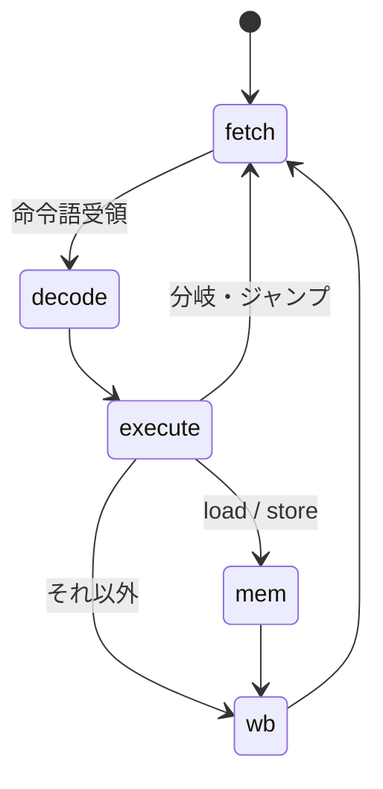

# RISC-V ソフトコア設計文書

Tang Nano 9K 上で動作する RV32I ソフトコアを自前実装し，既存のペリフェラル
（UART / TF カード / LCD / PSRAM）をメモリマップドで束ねてプログラムを走らせる．
検証レイヤの定義・運用規則は [verification.md](verification.md)，
既存デザインは [rtl.md](rtl.md) を参照．

## 方針

- 公開されている RISC-V 仕様のみから自前実装する．既存 OSS 実装
  （PicoRV32・VexRiscv・CVA6 等）はコードを参照しない．RISC-V ISA は
  RISC-V International がロイヤリティフリーで仕様公開しており，
  仕様からの独自実装に権利上の問題はない
- **Linux は目標としない**（下記「Linux を目標にしない理由」）．
  到達点は「自作コアが SD カードからプログラムをロードし，LCD へ描画する」
- 既存サブシステムは作り直さず，メモリマップドペリフェラルとして再利用する．
  ハードコードした FSM（Fat32Reader・TfImageDemo・PsramMemtest）は
  段階的にソフトウェアへ移し，その分の LUT をコアへ振り替える
- 検証はレイヤを分け，riscv-tests を「実装から独立したオラクル」として使う

### Linux を目標にしない理由

実測値に基づく判断である．

| 制約 | 実測 | 含意 |
| --- | --- | --- |
| PSRAM 実効帯域 | 2.25 MB/s（[tfcard.md](tfcard.md)「帯域の制約と解像度の決定」） | 命令フェッチだけで上限 約 0.56 MIPS．データアクセス込みで半減 |
| PSRAM 容量 | ch0 4 MB のみ配線（SIP 全体で 2ch x 4 MB = 8 MB） | MMU 付き Linux には不足（実質 32 MB 以上が目安） |
| LUT4 | 6656 / 8640（77%，画像デモ構成） | 空き約 1980．MMU + キャッシュ + コアは載らない |

バーストと DDR 復帰で帯域は改善できる（線形バーストで約 23 MB/s，DDR で更に倍）が，
容量の制約は動かせない．nommu Linux は 8 MB クラスの実績があるものの，
比較対象（K210 等）は数百 MHz・SRAM 直結であり，27 MHz・PSRAM 経由の本構成とは
体感が桁違いになる．よって OS 的な目標は段階 11 到達後に再評価する．

## 一次資料

仕様書の実体は git 管理外（`docs/datasheets/`）に置き，本表で版数・取得元・
SHA-256 を記録する（[psram.md](psram.md) と同じ運用）．

| 資料 | 用途 | 取得元 | 版数 | SHA-256 |
| --- | --- | --- | --- | --- |
| RISC-V Instruction Set Manual（Unprivileged + Privileged 合本） | RV32I / M 拡張の命令定義・符号化，CSR・トラップ（段階 9 以降） | github.com/riscv/riscv-isa-manual/releases/download/riscv-isa-release-fcd15c1-2026-08-18/riscv-spec.pdf | release `riscv-isa-release-fcd15c1-2026-08-18`（commit fcd15c1） | `f2c7cb4940f5d49762e2b82a5e898e8d7caea398c17aec4a55b11516ae4af6bf` |

SHA-256 は GitHub Releases API のアセット digest と照合済み（OSS CAD Suite / Veryl と
同じ pin 方式．上流に署名はないため，この pin が保証するのは転送路改竄と
pin 後の変更の検出まで）．

RISC-V の仕様書は日次ビルドで公開されており「版数」に相当するのはリリースタグである．
RV32I と M 拡張は批准済みで内容は変わらないため，引用可能な特定スナップショットを
固定する方針とした．

## ISA スコープ

| 段階 | 内容 |
| --- | --- |
| v1 | RV32I（基本整数命令）．M モードのみ |
| v2 | M 拡張（乗除算） |
| v3 | Zicsr と割り込み（CLINT: mtime / mtimecmp，mstatus / mie / mip / mtvec / mepc / mcause） |

**非対応**（現時点）: 圧縮命令 C・A 拡張・F/D 拡張・MMU（Sv32）・U/S モード・
**非整列アクセス**（下記）．
C 拡張はコードサイズが BSRAM 容量に直結するため，段階 8 以降で費用対効果を再評価する．

## マイクロアーキテクチャ

**多サイクル（非パイプライン）** の FSM とする．

- メモリが律速（0.56 MIPS 相当）であり，パイプライン化の利得が小さい
- 面積が最小．LUT の空きが限られる本ボードでは支配的な判断材料になる
- 1 命令 = 1 トランザクション境界で状態が観測でき，L1 検証が単純になる



### メモリインタフェース

コアとメモリは 1 アウトスタンディングの簡易プロトコルで結ぶ．

- コアが `o_mem_valid` を上げ，アドレス・書き込みデータ・バイトイネーブルを保持する
- メモリは受理した次のサイクルに `i_mem_done` を 1 サイクル上げ，
  リードならこのとき `i_mem_rdata` が有効
- コアは `i_mem_done` で `o_mem_valid` を下ろす

`RvMem` はバイトイネーブルのために 8 bit 幅の RAM を 4 面並べる
（`$std::ram` はバイトイネーブルを持たない）．`BUFFER_OUT: true` の登録読み出しに
することで BSRAM へ載る（`false` は組合せ読み出しになり分散 RAM になってしまう）．

`i_dbg_*` はテストベンチからのプログラムプリロード用で，合成時は 0 固定にする．
`i_dbg_we` の間はコアの要求を受け付けないため，コアはリセット解除後でも
`o_done` 待ちで停止したままプリロードできる．

### レジスタファイルの実装（2026-08-23 改訂）

32 x 32 bit．x0 は読み出し 0 固定・書き込み無効とする．

当初はフリップフロップ + 組合せ読み出しで実装したが，**LUT を極端に食う**ことが
実測で分かったためメモリマクロ実装（`$std::ram` を読み出しポートごとに 1 面，
書き込みは両面へ）へ改めた．

| 実装 | TopRv の LUT4 | DFF | 最大周波数 |
| --- | --- | --- | --- |
| フリップフロップ + 組合せ読み出し | 5688 / 8640（65%） | 1266 | 36.03 MHz |
| メモリマクロ（現行） | **2729 / 8640（31%）** | 510 | 49.91 MHz |

単体合成では，フリップフロップ版のレジスタファイルだけで LUT セル 4921・DFF 992 を
占め，コア全体（5101）のほぼ全部だった．「32 本のうち任意の 1 本を選ぶ」を組合せで
作ると 32:1 x 32 bit のマルチプレクサが読み出しポートぶん必要になるためである．

改訂後は **`RAM16SDP4` x 32**（Gowin の LUT ベース分散 RAM，16 語 x 4 bit）へ
マップされた（2 ポート x 32/16 語 x 32/4 bit = 32 個）．BSRAM の消費は
変わらず 4 個（`RvMem` のバイトレーン）のままで，BSRAM は他用途に残る．

**要点はマクロの種別ではなく，RAM として推論させたこと**にある．
当初実装は配列の全要素に非同期リセットを掛けていたため，yosys は RAM へ
推論できずマルチプレクサに落としていた．

代償は読み出しが 1 サイクル遅れることで，コアに `rdreg` 状態を 1 つ足して吸収した．
パイプラインならフォワーディングの再設計が要るところで，多サイクル方式の利点が出た．

**リセットでレジスタは初期化されない**（RISC-V 仕様も初期値を定めない）．
ソフトウェアは使用前に初期化する必要がある．

## メモリマップ

段階 6 時点の `RvSoc` は次のとおり（デコードは `addr[29]` で MMIO，
`addr[13]` で ROM / RAM を分ける）．

| 範囲 | 内容 |
| --- | --- |
| `0x0000_0000`–`0x0000_1FFF` | ブート ROM（`RvBootRom`，リードのみ） |
| `0x0000_2000`–`0x0000_2FFF` | データ RAM（`RvMem`） |
| `0x2000_0000` | MMIO TOHOST（W．riscv-tests と同じ終了通知） |
| `0x2000_0010` | MMIO UART（W: 送信バイト / R: bit0 = 送信可） |
| `0x2000_0020` | MMIO LED（W: 下位 6 bit） |

将来の拡張予定（段階 7 以降）:

| 範囲 | 内容 |
| --- | --- |
| `0x1000_0000`–`0x103F_FFFF` | PSRAM ch0（AXI4-Lite ブリッジ経由） |
| `0x2000_0100`– | MMIO: TF カード（ブロックリード） |
| `0x2000_0200`– | MMIO: フレームバッファ制御 |

命令とデータを同一空間に置く（フォンノイマン）が，多サイクル FSM では
フェッチとメモリアクセスが同時に起きないため構造ハザードは生じない．

## ブートフロー

1. ビットストリームに埋め込んだ BSRAM 初期値（第一段ローダ）から `0x0000_0000` で起動
2. 第一段ローダが TF カードの所定ファイルを PSRAM へロードする
3. PSRAM 上のエントリポイントへジャンプする

段階 4〜8 ではステップ 2 を省略し，テストプログラムを BSRAM へ直接埋め込む．

## 検証

レイヤ定義は [verification.md](verification.md) に従う．

| レイヤ | 内容 |
| --- | --- |
| L1 | 命令ごとの自作ネイティブテスト（RV32I 各命令・境界値・x0 の扱い・分岐条件） |
| L2 | **riscv-tests（rv32ui）** を Veryl シミュレータで実行し，MMIO への終了通知で pass/fail を判定する（環境は自前，下記） |
| L3 | 合成後ネットリスト検査（`verif/`） |
| L4 | 実機（UART 出力，LCD 表示） |

L1 と L2 の役割分担は PSRAM/TF カードと同じ考え方による．L1 は自作モデルと
DUT が同じ解釈を共有するため共通モード誤りを検出できない．riscv-tests は
実装から独立した外部オラクルであり，命令解釈の誤りを反証できる唯一の層になる．

### riscv-tests の取り込み（決定: コンテナで commit pin）

`container/Containerfile` で `riscv-software-src/riscv-tests` を
commit `2ebecad997fa58cd9e5724340ba75aa4b59bd1d0`（2026-08-14）に固定して取得する．
git の commit SHA が内容の完全性を担保するため，別途ハッシュ表は設けない．
サブモジュール `env` は親コミットが記録する版に従う．

#### テスト環境は自前に置き換える

標準の `env/p`（machine-mode 物理アドレス環境）は起動時に `mtvec` / `mcause` /
`mhartid` を触るため **Zicsr を要求する**（アセンブル時に
`unrecognized opcode 'csrr t5,mcause', extension 'zicsr' required` で失敗することを確認）．
Zicsr は段階 9 の予定であり，それまで rv32ui を回せない．

そこで**環境（ブートと終了通知）だけを自前に置き換える**．
`verif/riscv/env/riscv_test.h` と `verif/riscv/env/link.ld` がそれで，
CSR を一切使わず，終了は `MMIO_TOHOST`（`0x2000_0000`）へのストアで通知する
（値の規約は riscv-tests と同じく 1 = pass，`(テスト番号 << 1) | 1` = fail）．

**テスト本体（`isa/rv64ui/*.S` と `isa/macros/scalar/test_macros.h`）は改変しない**．
命令解釈のオラクルはテスト本体であり，環境は足場に過ぎないため，
差し替えても外部オラクルとしての性質は保たれる．

`verif/riscv/build_tests.sh` でビルドし，`scripts/gen_riscv_rom.py` が
`build/riscv_tests/*.bin` を Veryl パッケージ `RvTestImg`
（`src/riscv/test_rom.veryl`）へ変換する．巨大な単一 case 式は veryl の
コード生成でスタックオーバーフローするため，テスト毎・512 分岐毎に補助関数へ
分割する（`gen_tf_test_image.py` と同じ方式）．

ランナーは `src/riscv/test_riscv_tests.veryl`．テスト毎にリセットして
プログラムをプリロードし，`MMIO_TOHOST` へのストアで pass/fail を判定する．

#### 結果（2026-08-23）

**rv32ui 42 件中 40 件を実行し，全件 pass**．除外は 2 件．

| 除外 | 理由 |
| --- | --- |
| `fence_i` | `fence.i` は Zifencei 拡張であり本コアの対象外（「ISA スコープ」） |
| `ma_data` | 非整列アクセスが**ハードウェアで動作すること**を要求する（`lh s0, 1(base)` 等）．RISC-V 仕様は「ハードウェア対応」と「アドレス非整列例外の送出」のいずれも許容するが，本コアは現状どちらでもない |

`ma_data` は L2 導入によって初めて顕在化した．L1（自作テスト）は整列アクセスしか
書いていなかったため検出できず，外部オラクルを入れる意義がそのまま現れた事例である．

## ツールチェーン

コンテナ（[environment.md](environment.md)）へ Debian trixie のベアメタル
ツールチェーンを追加した．

| ツール | 版数（2026-08-23 時点） |
| --- | --- |
| `riscv64-unknown-elf-gcc` | 14.2.0+19 |
| `riscv64-unknown-elf-as`（binutils） | 2.44 |
| riscv-tests | commit `2ebecad997fa58cd9e5724340ba75aa4b59bd1d0` |

`-march=rv32i -mabi=ilp32` の multilib が存在することを確認済み
（`-print-multi-directory` が `rv32i/ilp32` を返す）．libc は使わず
`-nostdlib -nostartfiles` の freestanding でビルドする．

## ブリングアップ用トップ（TopRv）

既存の `Top`（UART エコー + LCD + PSRAM + TF カード）は LUT4 を 77% 使っており，
ソフトコアと同居できない．そこで段階 6〜9 は `TopRv`（ソフトコアのみ）を
別ビットストリームとして扱う．

| 対象 | 合成スクリプト | 制約 | 出力 |
| --- | --- | --- | --- |
| `Top` | `scripts/synth.ys` / `synth_pnr.sh` | `constraints/tangnano9k.cst` | `build/top.fs` |
| `TopRv` | `scripts/synth_rv.ys` / `synth_pnr_rv.sh` | `constraints/tangnano9k_rv.cst` | `build/top_rv.fs` |

`TopRv` は PLL を持たない 27 MHz 単一クロックのため，`--sdc` によるクロック別制約は不要．

### 実機結果（2026-08-23）

`build/top_rv.fs` を SRAM へロードし，UART で以下を確認した．

```
Hello from the RV32I core on Tang Nano 9K!
PSRAM OK
```

1 行目は自作 RV32I コアがブート ROM から起動し，MMIO の UART ステータスを
ポーリングしながら 1 バイトずつ送出できていることを示す．
2 行目は **コアが PSRAM へ 64 語のパターンを書き，読み返して全て一致した**
ことを示す（`software/hello.S`）．経路は
コア → `RvAxiMaster` → AXI4-Lite → `PsramAxiBridge`（CDC 27↔54 MHz）→
`PsramCtrl` → `PsramPhySdr` → HyperBus．続く LED 点滅ループも同じプログラムに含まれる．

#### 複数ボード接続時の誤書き込み防止

Tang Primer 20K を同時に接続していると，どちらも FTDI 0403:6010 として
列挙されるため対象の取り違えが起こりうる．実測では次のとおりだった．

| デバイス | COM | 備考 |
| --- | --- | --- |
| Tang Nano 9K | COM4 | USB serial `FACTORYAIOT_PRO`，bus 001 dev 020．IDCODE 0x100481b = GW1N(R)-9C |
| Tang Primer 20K | COM5 | openFPGALoader からは開けない状態だった |

`scripts/flash.ps1` は書き込み前に `--detect` で IDCODE を確認し，
GW1N(R)-9C 以外なら中断するようにした．UART も `-Port` で明示指定する．

### 資源（2026-08-23，TopRv）

| 項目 | 値 |
| --- | --- |
| LUT4 | 3852 / 8640（44%，PSRAM サブシステム込み） |
| DFF | 1177 / 6480（18%） |
| BSRAM | 4 / 26（`RvMem` のバイトレーン 4 面） |
| 最大周波数 | clk_mem 121.27 MHz（54 MHz 制約）/ i_clk 53.57 MHz（27 MHz 制約） |

PSRAM サブシステムを含まない段階 6 時点では LUT4 2729（31%）だった
（レジスタファイルのメモリマクロ化による．「レジスタファイルの実装」節）。

`TopRv` も `clk_mem` を持つため，`Top` と同じく `--sdc` でクロック別制約を与える
（`constraints/tangnano9k_rv.sdc`）．ネット名は `PsramSubsystem` の
インスタンス名を含む `psram.clk_mem` になる．

## LCD デモ

到達点として LCD に何かを描く．経路は 2 つあり，いずれも既存資産を再利用する．

| 案 | 経路 | 追加ハード | 備考 |
| --- | --- | --- | --- |
| (a) ASCII アート（Donut 等） | CPU → UART MMIO → TextConsole | なし | 既存の傍受表示をそのまま使える．三角関数と除算が必要なため固定小数点で実装する．RV32I ではソフト乗算になり重く，M 拡張後が現実的 |
| (b) フレームバッファ描画 | CPU → PSRAM → ImageScanout → LCD | なし | 100x60 RGB565 の経路は実機実証済み（[tfcard.md](tfcard.md)） |

段階 6 で (a) の簡易版（文字列出力）を通し，M 拡張後に Donut，
(b) はフレームバッファ拡張として並行して進める．

## パッチ計画

| # | 内容 | 検証 | 状態 |
| --- | --- | --- | --- |
| 1 | 本設計文書 | — | 済 |
| 2 | コンテナへ RISC-V ツールチェーンと riscv-tests を追加 | rv32i/ilp32 のアセンブル・リンク確認 | 済 |
| 3 | 命令デコーダ・レジスタファイル・ALU | L1 | 済（L1 4 件） |
| 4 | 多サイクルコア（RV32I）+ BSRAM 接続 | L1 | 済（L1 2 件） |
| 5 | riscv-tests 実行環境（rv32ui） | L2 | 済（40 件全 pass） |
| 6 | MMIO（UART / LED）と実機での文字列出力 | L4 | 済（実機で出力を確認） |
| 7 | AXI4-Lite マスタ化して PSRAM を接続 | L1 / L4 | 済（実機で PSRAM OK） |
| 8 | M 拡張（乗除算） | L1 / L2 | 未 |
| 9 | Zicsr・割り込み・タイマ（CLINT） | L1 / L2 | 未 |
| 10 | TF カードからのプログラムロード（第一段ローダ） | L4 | 未 |
| 11 | LCD デモ（Donut / フレームバッファ描画） | L4 | 未 |

## 残課題・リスク

| 項目 | 内容 | 対応 |
| --- | --- | --- |
| LUT 予算 | 既存 Top が 77%，TopRv が 44%（PSRAM 込み）．単純合算では同居できない | Fat32Reader・TfImageDemo・PsramMemtest をソフトウェアへ移して削減する |
| PSRAM サブシステムの重複 | `PsramSubsystem` へ切り出したが，既存 `Top` はまだインライン実装のまま | `Top` 側も `PsramSubsystem` へ寄せる（挙動不変のリファクタ．実機再確認が要る） |
| PSRAM 帯域 | 2.25 MB/s．PSRAM 上のコード実行は 0.5 MIPS 相当 | ホットパスは BSRAM 常駐とする．線形バースト実装と BSRAM 命令キャッシュは段階 7 以降で評価 |
| Zifencei（`fence.i`） | 対象外のため rv32ui の `fence_i` を除外している | 自己書き換えコードを扱う段階になったら再検討 |
| 非整列アクセス | 未対応（`ma_data` を除外）．現状は含まれるワードを読み書きしてしまい，仕様が許す 2 つの挙動（ハードウェア対応 / 例外送出）のどちらでもない | 段階 9（Zicsr・トラップ）でアドレス非整列例外を送出する形に揃える．ハードウェア対応は面積と引き換えになるため採らない |
| 圧縮命令 C の要否 | コードサイズが BSRAM 容量に直結する | 段階 8 以降で費用対効果を評価 |
| 命令符号化の照合 | 仕様書は取得済み（一次資料表） | デコーダ実装時に符号化表と 1 対 1 で照合する |
