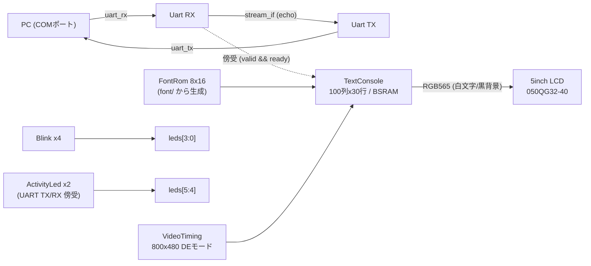

# RTL 設計

本文書は現行デザイン（Lチカ・UART エコー・LCD テキストコンソール）の設計を記述する．
PSRAM サブシステムの設計は [psram.md](psram.md)，検証方針は
[verification.md](verification.md) を参照．

## クロック・リセット方針

クロックは 27 MHz オシレータ単一ドメイン（PLL 不使用），リセットは S1 ボタン
（active-low，Veryl 既定リセット async_low と整合）．

例外: PSRAM サブシステムは rPLL 生成の専用ドメインを持つ（[psram.md](psram.md)）．
既存モジュールのドメインは変更しない．

## 構成



LED 割当（すべて active-low）:

| LED | 内容 |
| --- | --- |
| leds[0..3] | 1〜4 Hz 点滅（生存表示） |
| leds[4] | UART RX アクティビティ（100 ms 保持） |
| leds[5] | UART TX アクティビティ（100 ms 保持） |

| モジュール | ファイル | 概要 |
| --- | --- | --- |
| Top | src/top.veryl | 全体統合（UARTエコー + 傍受テキスト表示 + LED点滅） |
| Blink | src/blink.veryl | 分周点滅（LED 割当表を参照） |
| ActivityLed | src/common/activity_led.veryl | UART TX/RX ラインの Low を 100 ms 引き伸ばすインジケータ（leds[5:4]） |
| PsramSpikeBitbang | src/psram/spike_bitbang.veryl | PSRAM ch0 レジスタ読み出し spike（[psram.md](psram.md)） |
| stream_if | src/common/stream.veryl | valid/ready ハンドシェイクの汎用 stream interface |
| Uart | src/uart/uart.veryl | 115200bps 8N1．RX は 2FF 同期 + 中央サンプリング，ノンブロッキング供給 |
| VideoTiming | src/video/timing.veryl | LCD タイミング生成（datasheet 導出の 27MHz 直結 59.1Hz，HTotal=890 x VTotal=513） |
| TextConsole | src/video/console.veryl | 文字書き込み（LF/CR/折り返し/リングバッファスクロール）+ 描画 2 段パイプライン |
| FontRom | src/video/font_rom.veryl | 8x16 フォント ROM（生成物，編集しない） |

テキスト表示は UART TX（エコー経路）へ流れるバイトを傍受する構成のため，
PC から送った文字がエコーと同時に LCD へ蓄積される．printable (0x20-0x7E) 表示，
LF=改行，CR=行頭復帰，その他は無視．右端折り返しと最下行スクロールに対応する．

## フォント

`font/font8x16.txt`（[font8x16-workbench](https://github.com/sabas0ba/font8x16-workbench)，
CC0 1.0）を一次ソースとし，`scripts/gen_font_rom.py`（Python 標準ライブラリのみ）で
`src/video/font_rom.veryl` を生成する．フォント更新時は再生成してコミットする:

```powershell
python .\scripts\gen_font_rom.py
```

## ピン割当

`constraints/tangnano9k.cst` に記載（ピン番号の出典は Sipeed 公式サンプル，記述は独自）．

| 信号 | ピン | 備考 |
| --- | --- | --- |
| i_clk | 52 | 27 MHz オシレータ |
| i_rst | 4 | S1 ボタン，active-low |
| leds[5:0] | 16,15,14,13,11,10 | active-low |
| uart_tx / uart_rx | 17 / 18 | BL702 経由の USB-CDC シリアル |
| lcd_clk / lcd_de | 35 / 33 | pclk は反転出力（ラッチエッジと遷移を半周期分離） |
| lcd_vsync / lcd_hsync | 34 / 40 | 負極性 |
| lcd_r[4:0] | 75,74,73,72,71 | RGB565 |
| lcd_g[5:0] | 70,69,68,57,56,55 | |
| lcd_b[4:0] | 54,53,51,42,41 | |

## References（ボード・デバイス）

| 資料 | 内容 | URL |
| --- | --- | --- |
| Tang Nano 9K wiki | ボード仕様 | <https://wiki.sipeed.com/hardware/en/tang/Tang-Nano-9K/Nano-9K.html> |
| Tang Nano 9K 回路図 | 回路・ピンの一次資料 | <https://dl.sipeed.com/shareURL/TANG/Nano%209K/2_Schematic> |
| Sipeed 公式サンプル (LED) | LEDピン割当の出典 | <https://github.com/sipeed/TangNano-9K-example/blob/main/led/src/9K_LED_project.cst> |
| Sipeed 公式サンプル (UART/LCD) | UART・LCDピン割当の出典 | <https://github.com/sipeed/TangNano-9K-example> |
| 5inch LCD datasheet | LCDタイミングの一次資料 (6.4節) | <https://dl.sipeed.com/fileList/TANG/Nano%209K/6_Chip_Manual/EN/LCD_Datasheet/5.0inch_LCD_Datashet%20_RGB_.pdf> |
| Sipeed Wiki rgb_screen | LCD接続チュートリアル (sync極性等) | <https://github.com/sipeed/sipeed_wiki/blob/main/docs/hardware/en/tang/Tang-Nano-9K/examples/rgb_screen.md> |
| font8x16-workbench | フォントデータ (CC0 1.0) と編集ツール | <https://github.com/sabas0ba/font8x16-workbench> |
