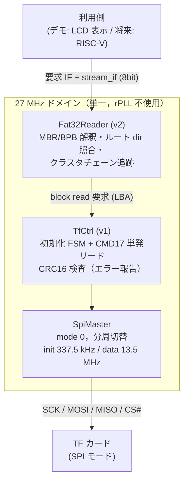

# TF カードコントローラ設計文書

Tang Nano 9K の TF カードスロットを SPI モードで制御し，カード上のデータを
読み出すためのコントローラ設計．リード専用とし，既存資産とツールチェーン pin を
変更せず，サブシステム追加として実装する．
本文書ではカードを TF カードと表記する（一次資料表の正式名称を除く）．
検証レイヤの定義・運用規則は [verification.md](verification.md)，
既存デザインは [rtl.md](rtl.md) を参照．

## 方針

- **リード専用**．ファイルシステムの更新（FAT・ディレクトリエントリ等の書き換え）を
  ワイヤードロジックで行うことは複雑度・破壊リスクの点で不適切と判断し，
  write 系コマンドは一切実装しない．書き込みが必要になった場合は
  RISC-V 導入後のソフトウェア実装領域とする
- 外部 RTL の引用・流用は行わず，一次資料（カード仕様・FAT 仕様・回路図）から
  自前実装する
- 対応カード: ブロックアドレッシング世代（OCR CCS=1，2 GB 超）のみ．
  バイトアドレッシングの旧世代カード（CCS=0）は初期化時に検出して
  非対応エラーとする（アドレス変換分岐の削減）
- ファイルシステムは FAT32 のみ・8.3 名のみ・ルートディレクトリ直下のみ・リード専用．
  exFAT は実装コストと権利面（特許ライセンス史のある領域）から非対応とし，
  exFAT で出荷される大容量カードは FAT32 への再フォーマットを利用条件とする．
  FAT32 は Microsoft 公開仕様（EFI FAT specification）に基づき，LFN（VFAT 長名）は
  解釈せずスキップする
- カード規格団体のロゴ・商標は使用しない．実装は公開されている Simplified Specification の
  範囲で行う
- **PSRAM には依存しない**．PSRAM サブシステムは実機トラブルの解決待ちであり，
  本サブシステムは BSRAM とレジスタのみで成立させる（パッチ計画の節を参照）

## 一次資料

データシート・仕様書の実体は git 管理外（`docs/datasheets/`）に置き，
本表で版数・取得元・SHA-256 を記録する．

| 資料 | 用途 | 取得元 | 版数 | SHA-256 |
| --- | --- | --- | --- | --- |
| SD Simplified Physical Layer Specification | SPI モードプロトコル・初期化・コマンド/レスポンス・タイミング | sdcard.org/downloads/pls/（クリックスルー同意経由，利用者取得） | 9.00 (2022-08-22) | TBD |
| Microsoft FAT32 File System Specification (fatgen103) | BPB・FAT・ディレクトリエントリ構造 | download.microsoft.com/download/1/6/1/161ba512-40e2-4cc9-843a-923143f3456c/fatgen103.doc | 1.03 (2000-12-06) | TBD |
| Tang Nano 9K 回路図 | TF スロットのピン割当・プルアップの実態 | dl.sipeed.com（[rtl.md](rtl.md) References に既載）．rev 3674 系 | TBD | — |

一次資料の実体はクリックスルー同意（Simplified Spec）等の事情により本環境では
未取得であり，プロトコル定数（NCR・各タイムアウト・レスポンスビット）は
広く知られた仕様値を「実装採用値」として本文書に明記した．
**取得後に SHA-256 と併せて照合し，差異があれば L1 モデルと RTL を同時に更新する**
（共通モード誤りの扱いは [verification.md](verification.md)）．

## アーキテクチャ



- **27 MHz 単一ドメインで実装する**（既存方針の例外を増やさない）．SCK は
  27 MHz からの分周で生成し，rPLL・CDC は不要
- v1 (TfCtrl) と v2 (Fat32Reader) は層として分離し，v1 単体でも
  raw 論理ブロックアクセスとして利用可能とする

### インタフェース

- **要求 IF**（v1）: valid/ready + `lba[31:0]`．応答は done パルス + エラー種別
  （なし / init 未完 / タイムアウト / CRC / 非対応カード / 応答異常）
- **データ IF**: 既存 `stream_if` の流儀による 8 bit ストリーム
  （512 バイト/ブロック）．AXI4-Lite はレジスタ型 IF でありブロック転送に
  不適なため採用しない
- **v2 要求 IF**: valid/ready + 8.3 名 11 バイト（`'?'` = 任意 1 文字のワイルドカード．
  例: `"????????TXT"` で拡張子 TXT の先頭ファイル）+ バイトオフセット + 長さ．
  応答は done パルス + エラー種別（なし / FS 不正 / 未発見 / ブロックリードエラー）
  + ファイルサイズ
- **バッファレスで実装する**（当初案からの変更）．SPI はマスタが SCK を止めれば
  カード側が待つため，バイト毎に stream_if の handshake を待つバックプレッシャで
  BSRAM 面バッファなしに成立する．転送レートのデカップリングが必要な利用側が
  現れた時点で BSRAM 512 B 面バッファを導入する．PSRAM には依存しない

### クロック・SCK

| 区間 | SCK | 生成 |
| --- | --- | --- |
| 初期化（ACMD41 完了まで） | 337.5 kHz（27 MHz / 80） | 分周カウンタ |
| データ転送 | 13.5 MHz（27 MHz / 2） | 同上 |

- 初期化クロックは仕様の 100〜400 kHz 範囲に収める
- 13.5 MHz は SPI モード上限 25 MHz に対し安全側．実効帯域は
  約 1〜1.5 MB/s の見込みで，用途（テキスト・画像・将来のプログラムロード）に
  対して十分．引き上げ（27 MHz 直結等）は仕様上限超過となるため行わない
- MISO のサンプリングは SCK 立上りを生成する posedge でレジスタ入力を取り込む
  （13.5 MHz 時は SCK 立下りから 37 ns 後のサンプルとなり，カードの出力遅延に
  対して余裕がある）

### ピン割当（暫定，回路図 PDF で最終確認要）

回路図（rev 3674 系）のテキスト抽出による．抵抗の接続先の確定と最終確認は
PDF 原本で行う（残課題）．

| 信号 | FPGA ピン | ダイ IO | スロット側 | 備考 |
| --- | --- | --- | --- | --- |
| tf_cs_n | 38 | IOB31B | DAT3/CS | プルアップありとみられる（コンフィグ中 Hi-Z でも CS# High が保たれ，意図しない選択を防ぐ）．要確認 |
| tf_mosi | 37 | IOB31A | CMD/MOSI | 10 kΩ プルアップ (R20) を確認 |
| tf_sclk | 36 | IOB29B | CLK | |
| tf_miso | 39 | IOB33A | DAT0/MISO | |
| — | 未接続 | — | DAT1 / DAT2 | FPGA へ配線なし．SPI モードでは未使用のため影響なし |

- いずれも 3.3 V バンク（既存 UART/LED と同系）．cst には通常の IO_LOC で記載する．
  tf_miso / tf_cs_n / tf_mosi は FPGA 側も PULL_MODE=UP とする
  （カード未挿入時に MISO が 0xFF に読め，タイムアウト検出が安定する）
- Sipeed 公式サンプルのピン割当（36-39）とも一致

## プロトコル仕様（v1 スコープ）

実装採用値（Simplified Specification 取得後に照合，「一次資料」節）:

| 項目 | 採用値 |
| --- | --- |
| NCR（コマンド→R1 応答） | 最大 8 バイト（0xFF を 8 バイト読んで MSB=0 が来なければ応答タイムアウト） |
| ACMD41 ポーリング上限 | 3000 回（337.5 kHz で約 1.2 s > 仕様の初期化タイムアウト 1 s） |
| データトークン待ち上限 | 262144 バイト（13.5 MHz で約 155 ms > 仕様のリードタイムアウト 100 ms） |
| コマンド間ギャップ | CS# High で 0xFF を 1 バイト送出 |
| R1 ビット | bit6-0 = param err / addr err / erase seq err / CRC err / illegal cmd / erase reset / idle |

**初期化シーケンス**:

1. 電源投入後，CS# High・MOSI High のまま 74 クロック以上供給
   （0xFF を 10 バイト送出 = 80 クロック）
2. CMD0（CS# Low，CRC7 必須）→ R1 = 0x01 (idle) 確認
3. CMD8（arg = 0x1AA: 電圧範囲 + チェックパターン，CRC7 必須）→ R7 確認．
   R1 で illegal command，または R7 下位 12 bit ≠ 0x1AA は旧世代カードとして
   **非対応エラー**へ遷移
4. CMD55 + ACMD41（HCS=1）を R1 idle 解除までポーリング（上限回数でタイムアウト）
5. CMD58 → OCR の CCS ビットでブロックアドレッシングを確認．
   CCS=0（旧世代カード）は非対応エラー
6. データ転送クロックへ切替

CRC7 は全コマンドで正しい値を計算して送出する（初期化後は仕様上 don't care だが，
分岐を作るより常時計算のほうが単純）．

**ブロックリード**: CMD17（引数 = LBA）→ R1 → データトークン (FEh) 待ち →
512 バイト + CRC16 受信．CRC16 は検査しエラーフラグとして報告する
（データは検査完了前にストリーム済みのため，リトライは利用側判断）．

**CMD59（CRC 有効化）は発行しない**（当初 TBD の確定）．SPI モードの既定では
コマンド CRC7 は CMD0/CMD8 以外検査されず，リードデータの CRC16 はカードが常に
送出するため，受信側検査だけで v1 の目的（エラー検出と報告）は満たせる．
spike の実測で CRC 不一致が観測された場合に再検討する．

**発行コマンドのホワイトリスト**: CMD0 / CMD8 / CMD55 / ACMD41 / CMD58 / CMD17．
**これ以外（特に write 系 CMD24/25，erase 系）は FSM 上存在しない**．

## FAT32 リーダ仕様（v2 スコープ）

- MBR: パーティション 1 のみ参照（タイプ 0Bh/0Ch，署名 55AAh）．
  セクタ 0 の先頭バイトが JMP（EBh/E9h）かつ BytsPerSec=512 の場合は
  スーパーフロッピー形式（BPB 直置き）としてパーティション開始 LBA=0 で扱う
  （当初 TBD の確定．判定が安価なため対応する）
- BPB: バイト/セクタ = 512 固定を検証，セクタ/クラスタ（2 冪）・予約セクタ数・
  FAT 数・FAT サイズ (FATSz32)・ルートクラスタ番号を取得．
  FATSz16 ≠ 0 等の FAT12/16 形跡は FS 不正エラー
- ルートディレクトリのみ列挙．8.3 名エントリのみ解釈し，LFN エントリ
  （属性 0Fh）・削除済み（先頭 E5h）・ボリュームラベル・サブディレクトリはスキップ．
  先頭バイト 00h で列挙終端
- ファイル照合: 11 バイトの 8.3 名（大文字・空白パディング）完全一致．
  要求名の `'?'` (3Fh) は任意 1 文字に一致（拡張子だけの照合に使用）
- ファイル読み出し: 開始クラスタから FAT チェーンを辿り，該当セクタへの
  CMD17 を発行．チェーン終端（FAT エントリ & 0FFFFFFFh ≥ 0FFFFFF8h）と
  ファイルサイズ・要求長の最短で打ち切る．オフセット起点はクラスタチェーンの
  スキップ + セクタ内バイト破棄で実現する
- FAT 参照はクラスタ遷移毎に該当 FAT セクタを 1 ブロックリードする
  （キャッシュなし．シーケンシャルリード主体の用途では十分）
- 書き込み系の構造（FSInfo 更新等）は一切触れない

## 検証

レイヤ定義は [verification.md](verification.md) に従う．

### L4 でしか反証できない項目（spike の存在理由）

1. **ボード配線の実態**: TF スロットのピン割当・プルアップ有無（回路図で事前確認の上，
   実機で疎通確認）．SPI モード選択は CMD0 時の CS# Low で行うため DAT3/CS の
   初期状態が影響する
2. **カード個体差**: ACMD41 のポーリング所要回数，CMD8 応答，初期化クロック余裕．
   仕様が許容する幅の中のどこに実カードがいるかは実機でしか分からない
3. **電源投入直後の 74 クロック要件の現実**（ボード電源シーケンス依存）

### spike の構成

初期化完走 + セクタ 0（MBR）リードを行い，R1 各段の値・OCR・セクタ先頭
16 バイト・MBR 署名 (55AAh) 検査結果を UART/LCD へ報告する．
bit-bang は不要（SpiMaster 自体が単純なため，spike は SpiMaster +
最小シーケンサで構成し，成果物はそのまま v1 の部品になる）．
手持ちの複数カードで実施し，個体差（ACMD41 回数等）を本文書へ記録する．

報告フォーマット（1 行 ASCII）:

```
TF R1=xx,xx,xx,xx OCR=xxxxxxxx S0=<先頭16バイトhex> SIG=K E=-
```

- `R1=` は CMD0 / CMD8 / ACMD41（最終）/ CMD58 の R1
- `SIG=` は MBR 署名 55AAh の検査（K=一致 / N=不一致）
- `E=` はエラー段（`-`=なし，`0`=CMD0，`8`=CMD8 非対応，`A`=ACMD41 タイムアウト，
  `C`=CCS=0 非対応，`R`=CMD17 応答/トークン異常，`X`=データ CRC16 不一致）

spike 実機結果: **未実施**（実機確認は利用者に委ねる．結果は本節へ追記する）．

### L1: 自作ビヘイビアモデルとテスト

- TF カードモデル (`src/tfcard/tf_card_model.veryl`): SPI ビット列で CMD をデコードし，
  R1/R7/R3・データトークン・CRC16 を応答する．初期化状態機械（idle 解除まで N 回要求）と
  背後ストレージ（`o_img_lba`/`o_img_off` → `i_img_data` の組合せ参照で
  テストベンチからディスクイメージ関数を注入）を持つ．
  エラー注入（CMD8 無応答 = 旧世代カード / CCS=0 / ACMD41 idle 継続 /
  データトークン無送出 / CRC16 破壊）を設定ポートで備える．
  すべて Simplified Specification の自前解釈起点で実装（外部コード引用なし）
- モデルはシステムクロック同期（27 MHz オーバーサンプル）で SCK エッジを検出する．
  ノンブロッキング代入の意味論により SCK=13.5 MHz（半周期 1 サイクル）でも
  マスタが駆動した安定値を観測できる
- ディスクイメージ生成スクリプト（Python 標準ライブラリのみ，
  `scripts/gen_tf_test_image.py`）: MBR・BPB・FAT・ルート dir・ファイル実体を
  直接構築し，非ゼロバイトのみの疎な参照関数（Veryl 生成物）として出力する．
  L1 の FAT32 テストへ再現性のある入力を与える．テストイメージは構造的に
  FAT32（FATSz32/RootClus 使用）だが，最小クラスタ数（65525）の規定は
  満たさない縮小版であることに注意
- テスト: 初期化正常系 / 旧世代カード検出エラー / ACMD41 タイムアウト / CMD17 正常・
  CRC 不一致・データトークンタイムアウト / FAT32: BPB 解釈・8.3 名照合・
  LFN スキップ・クラスタチェーン追跡（断片化イメージ含む）・チェーン終端
- CRC 実装は DUT とモデルで共有するため，両者の照合では CRC 自体の誤りを
  検出できない（共通モード）．実装と独立の既知検査値（CMD0/CMD8/CMD17 の
  CRC7，CRC16 の標準検査値 31C3h・オール FF ブロック 7FA1h）による
  固定テストを置く（`test_crc.veryl`）

### L1F: formal 適用先

- **発行コマンドがホワイトリスト外にならない**（リード専用性の機械的保証．
  本設計で最も価値のあるプロパティ）
- CS# アサート中のみ SCK が駆動される / コマンドは CS# Low 中に完結する
- 初期化完了前に CMD17 が発行されない
- stream_if: 512 バイト境界の整合（ブロックあたり転送数の不変条件）

## パッチ計画

**当初計画からの変更**: PSRAM サブシステムが実機トラブルの解決待ちのため，
「PSRAM サブシステム完了後に着手」の前提を外し，PSRAM 非依存の #1〜7 を先行する．
#8（画像デモ）のみ PSRAM 復旧後に着手する．

| # | commit | 内容 | PSRAM 依存 | 状態 |
| --- | --- | --- | --- | --- |
| 1 | `docs: add TF card controller design document` | 本文書 | なし | 済 |
| 2 | `feat: add spi master` | SpiMaster + L1 テスト | なし | 済 |
| 3 | `feat: add tfcard init spike` | 初期化完走 + セクタ 0 リード + UART/LCD 報告（TF カードモデルもここで導入し L1 を先行させる） | なし | 済 |
| 4 | `feat: add tfcard block read controller` | TfCtrl v1 + モデルのエラー注入拡張 + テスト | なし | 済 |
| 5 | `feat: add fat32 reader` | Fat32Reader + イメージ生成スクリプト + テスト | なし | 済 |
| 6 | `feat: add tfcard text display demo` | ルートのテキストファイルを LCD 表示 | なし | 済 |
| 7 | `test: add formal properties for tfcard controller` | formal ハーネス（ホワイトリスト等） | なし | 未（sby 実行環境で実施） |
| 8 | `feat: add tfcard image display demo` | 画像ファイルを PSRAM フレームバッファへ展開し LCD 表示 | **あり** | 保留（PSRAM 復旧待ち） |

## 残課題・リスク

| 項目 | 内容 | 対応 |
| --- | --- | --- |
| 実機確認（L4） | spike・デモとも実機未実施 | 利用者が spike（パッチ #3 時点の Top）→ デモ（パッチ #6 時点の Top）の順で確認し，結果を本文書へ追記 |
| TF スロットのプルアップ最終確認 | ピン割当（36-39）と CMD/MOSI の 10 kΩ プルアップは回路図テキスト抽出で確認済み（「ピン割当（暫定）」節）．CS 等の全プルアップの網羅確認が残る | 回路図 PDF 原本の目視確認で確定し，暫定表を更新 |
| 一次資料の SHA-256 | Simplified Spec 9.00（クリックスルー経由）・fatgen103 1.03（直接 URL）とも版数・入手経路は確定，実体未取得 | 取得後に SHA-256 と参照節番号を記入し，実装採用値を照合 |
| カード相性 | 仕様逸脱気味の安価カードの存在が知られる | spike を複数カードで実施し結果を記録．非対応カードはエラー報告で明示 |
| formal（パッチ #7） | 本実装環境に sby / OSS CAD Suite がなく未実施 | コンテナ環境（[environment.md](environment.md)）で formal ハーネスを追加する |
| 画像デモのフォーマット | 無圧縮 BMP か raw RGB565 か | パッチ #8 設計時に決定（PSRAM 側 IF 確定後） |
